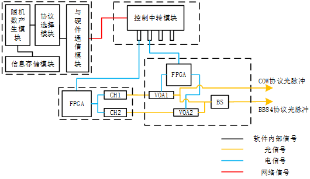

=============
00_前言
=============

1. 诱骗态量子光源设备整体介绍
============

1.1 诱骗态量子光源设备的框图结构
-------------------

本文档实现的诱骗态量子光源设备的框图如下所示：

在框图中左上角的虚线框中的为实现的 **上位机模块** 部分，它主要由以下几个部分组成:

.. note::
    1. **随机数产生模块** (产生可供协议选择模块调用的随机数，这也是包含诱骗态位置信息的源头)
    2. **协议选择模块** (选择具体的传输协议，然后不同的协议进行不同的数据处理过程。会在后面说明如何处理)
    3. **信息存储模块** (存储在本地的随机数数据，这是给通信发送方预先存储的具有诱骗态位置信息的数据)
    4. **与硬件通信模块** (使用的第三方库zmq来构建一个 “服务端——客户端” 架构)

框图中除开左上角虚线框的其他是 **硬件和光器件** 的部分，如图所示，它们由以下几个部分组成:

.. note::
    1. **FPGA开发板** (Alter Cyclone-IV系列开发板)
    2. **波长为1550nm的双通道激光器**
    3. **衰减范围为0~30dB的电控可调衰减器** (调节光脉冲的光强，实现多阶的诱骗态)
    4. **控制中转模块** (接收 **客户端** 即软件程序发出的命令，并下发给FPGA板。回传FPGA的信号给客户端)
    5. **光纤分束耦合器** (在传输协议为BB84协议下使用，将两束时间上复用的光脉冲耦合为一路)

1.1 诱骗态量子光源设备的下发过程
-------------------

本文档实现诱骗态量子光源设备的下发过程有以下几个步骤：

    1.	上位机软件根据用户设定的 **协议类型** 、 **诱骗态占比** 以及 **衰减器的衰减值** 进行操作。相关设置均会在显示窗口得到信息反馈
    2.	点击上位机软件中的 **开始发送** 按钮，此时上位机软件将用户设置好的信息，以 **套接字** 的形式打包并通过以太网口下发送给 **中转控制模块**
    3.	**控制中转模块** 将控制激光器触发的数据信息分发至激光源模块中的 **FPGA板** 。FPGA板接收到数据信息后，根据套接字中包含的有效信息进行处理，根据这部分信息发出包含诱骗态信息的伪随机电脉冲触发对应的激光管，使激光管发出含诱骗态信息的光脉冲
    4.	**控制中转模块** 将控制衰减器衰减值的数据信息分发至衰减控制整合模块中的 **FPGA** 板。FPGA板接收到数据信息后，根据套接字中的有效信息进行处理，根据这部分信息发出与衰减值相对应的电平值并触发电控可调衰减器（VOA）调谐至设置的衰减值。在光脉冲发送的过程中，可以通过调谐控制诱骗态路的光脉冲的衰减以达到实现多阶诱骗态的目的，在BB84协议下两路光脉冲通过BS合束为一路光脉冲
    5.	将 **步骤3** 中从激光器中发射的强光脉冲通过 **步骤4** 中所述的衰减整合模块，此时出射的光脉冲是 **含有诱骗态信息** 的 **准单光子脉冲**

本文档实现的为支持双协议的诱骗态量子光源设备，其特点在于:

.. note::
    1. 设备支持双种协议
    2. 设备由软件控制，灵活且能够快速增加需要的功能
    3. 操作简单，使用方面，能够适应教学及实验室环境的灵活使用

2. 技术文档安排介绍
============

技术文档将以以下几个部分依次介绍:

.. note::
    0. 前言
    1. 一个快速开始的教程
    2. 技术文档主要内容——如何实现本设备
    3. 对于某一些未完成或有待改善的内容进行介绍
    4. 技术文档的参考文档
