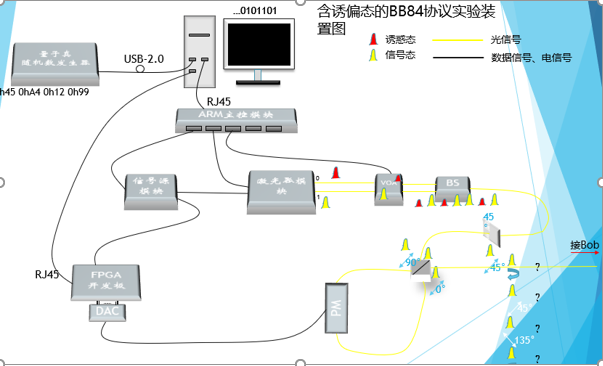
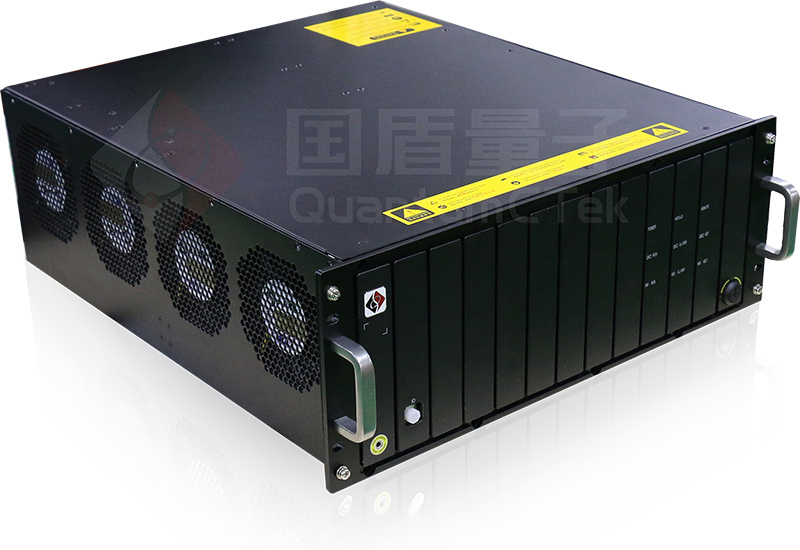
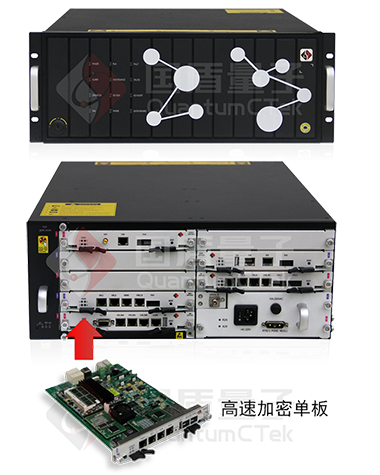
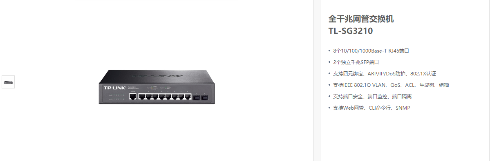
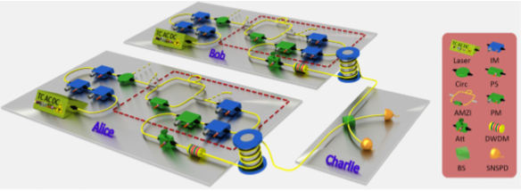

=============
项目仪器选型
=============

基于项目的框图调研本项目需要使用到的设备仪器：

.. note::
    1. 图中关键设备在于ARM主控模块，它的作用是让PC通过以太网口与多个设备进行联系，以达到通信的目的
    2. 图中的VOA是受电信号的控制，这部分的实现可结合FPGA和光强度调制器完成
    3. 图中的信号源模块可以直接由FPGA的内时钟给定，其目的是所有时序的器件使用一个全局时钟

1. 具体调研仪器设备
============

基于上述提到的ARM主控模板，其作用是通过PC的一个网口出来，能够连接控制多个设备。
具体形式可以参考国盾的该设备仪器：

从上图中可以看出，该设备后部是由多个插槽组成的，将不同的硬件设备插入，通过插入网口后，即可在PC上进行控制。

1.1 以太网交换机
------------

通过以上的论述，要实现ARM主控模块同等的功能，即可以使用以太网交换机来实现。

.. note::
    交换机
    
    交换机Switch，工作在数据链路层（第二层），稍微高端一点的交换机都有一个操作系统来支持。和集线器一样主要用于连接计算机等网络终端设备。 
    交换机比集线器更加先进，允许连接在交换机上的设备并行通讯，好比高速公路上的汽车并行行使一般，设备间通讯不会再发生冲突，因此交换机打破了冲突域，交换机每个接口是一个冲突域，不会与其他接口发生通讯冲突。 
    并且有系统的交换机可以记录MAC地址表，发送的数据不会再以广播方式发送到每个接口，而是直接到达目的接口，节省了接口带宽。但是交换机和集线器一样不能判断广播数据包，会把广播发送到全部接口，所以交换机和集线器一样连接了一个广播域网络。 
    高端一点的交换机不仅可以记录MAC地址表，还可以划分VLAN（虚拟局域网）来隔离广播，但是VLAN间也同样不能通讯。要使VLAN间能够通讯，必须有三层设备介入。 

关于以太网交换机我在网上调研了一些大厂的产品，最终选定型号为：TP-Link TL-SG3210 8口千兆网管型网络交换机

优势：背板宽带大，数据转发速度快；组网灵活，应用在大中型网络的接入层；支持VLAN划分，可以有针对性地对网络进行控制；网管型交换机的数据丢失率、延迟率低。

报价：499RMB（淘宝有售）

用途：让一台PC上位机能够和多台设备进行以太网通信

.. warning::
 使用交换机的难点是需要自己完成通信协议，通过一个通信协议使得PC和FPGA能够相互识别对面的数据含义。通过网口发送的数据是通过数据帧的形式发出，每一帧的数据中包含协议头信息+真正的数据信息+协议结束标志等信息。
 同时由于本项目是针对于多协议的，所以还需要在数据帧里区分不同的协议，以便让FPGA内部做出不同的操作。

1.2 标准型多路电控光衰减器
----------------

在这里我调研了多款电控的光衰减器。具体有以下几种（点击可访问查看）：

 1. `华泰Huatai VOA500系列 <http://www.catvworld.net.cn/products/attenuator/voa700/index.htm>`_ （杭州华泰） 
 2. `微处理器补偿型数控MEMS衰减器 <http://www.quantum-info.com/product/coredevice/2017/0504/120.html>`_ （国盾量子）
 3. `OZ电控可调光衰减器 <http://www.rayscience.com/product-13480.html>`_ （瞬渺光电）

最后与杜聪协商，他建议利用IM替代电控光衰减器，一方面是实验室现有，第二是体积小，方便以后封装。

.. note::

 同时我也在网上查阅到：
 有些衰减器中的衰减是由电信号控制的，如果衰减调节非常快速，该器件实际上可以看做是光调制器（任意光学强度调制器都可以看做是可变衰减器）

并且在潘建伟小组的关于MDI的论文中也是利用IM串联的方式替代光衰减器，如下：

2. 项目设备清单
============

    1.	激光器（已有 ，型号：QCL-102 皮秒脉冲激光器）
    2.	以太网交换机（需购入， 型号上述已给出）
    3.	PC（已有， 预装python软件的电脑即可）
    4.	FPGA板（已有，不过可能还需购入，型号：AX530）
    5.	强度调制器（已有，至少需要3个 型号：LN81S-FC）
    6.	分束器（已有，型号：BS-0x）
    7.	固定光衰减器（已有，型号SM3301，利用可编程光衰减器替代固衰）

3. 实现难点
============

整体项目的实现难点主要是以下几点：

 1. PC与以太网的交互协议需要自己编写，通过PC与硬件设备的自协商协议达到以太网通信的目的（这部分需要参考一些以太网通信的书籍）
 2. 如果验证诱骗态是否符合预期给定（① 利用强光的方法，在未衰减前检测诱骗态的占比 ② 利用单光子探测的方法，对于不同的平均光子数，对应区段的单光子计数不一样，不过这部分需要有能够从单光子探测器中取出对应计数的电路支持）
 3. 如果确定含诱骗态的准单光子源的起点位置（还需考虑，可以查阅其他文章或者专利是否有该问题的解决办法）

4. 创新点整理
============

 1. 兼容多协议（BB84,COW）的系统方法
 2. 多路衰减器控制诱骗态平均光子数的方法
 3. 软硬件结合及自动化控制系统的方法
 4. 适用于多协议的软件内部处理创新算法