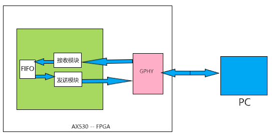

=====================
PC与FPGA的以太网通信
=====================

PC如何与FPGA的通信方式有很多中，根据FPGA的型号而定，就本项目所使用的FGPA(AX530)而言，通信方式不外乎有以下几种：
 1. 利用USB的串口通信 ———— 速度在百兆左右
 2. 利用以太网的网口通信 ———— 速度有百兆和千兆两个量级。
  .. note::
   其中由传输协议又细分为TCP协议和UDP协议
   
   TCP协议需要使用多次握手确定双方的连接关系，是一种安全的通信方式，并且由于建立了通信双方的连接，
   故传输的数据不会丢失，缺点是速度较UDP协议慢
   
   UDP协议是面向无连接的协议，即发送方只管发送信息，接收方只管接收信息。是一种适用于高速传输的场景中，例如：视频直播、网络游戏、聊天软件等都是利用了UDP协议。
   它会存在一定的丢包率，不过由于传输速率很快，所以较少的丢包并不会影响整体。

UDP协议
==================

.. note:: 
 UDP协议全称为（User Datagram Protocol），即用户数据报协议。UDP协议是一种基本的、低延迟的数据报的通讯。数据报就是一种自带寻址信息，从发送端到接收端的数据包。
 其常用于图像传输、网络监控数据交换等数据传输速度要求比较高的场合。

 更多关于UDP协议知识，请访问 `UDP百科 <https://baike.baidu.com/item/UDP>`_

基于本开发板的板上资源，通信协议采用 Ethernet UDP通信协议，FPGA通过GMII总线和开发板上的Gigabit PHY芯片通信，Gigabit PHY芯片再把数据通过网线发送给PC。
传输示意图如下：

在本开发板（AX530）中，采用