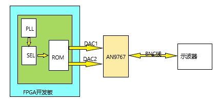
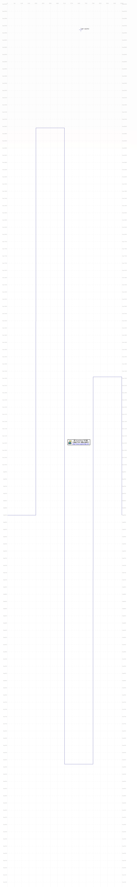
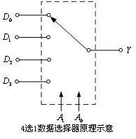
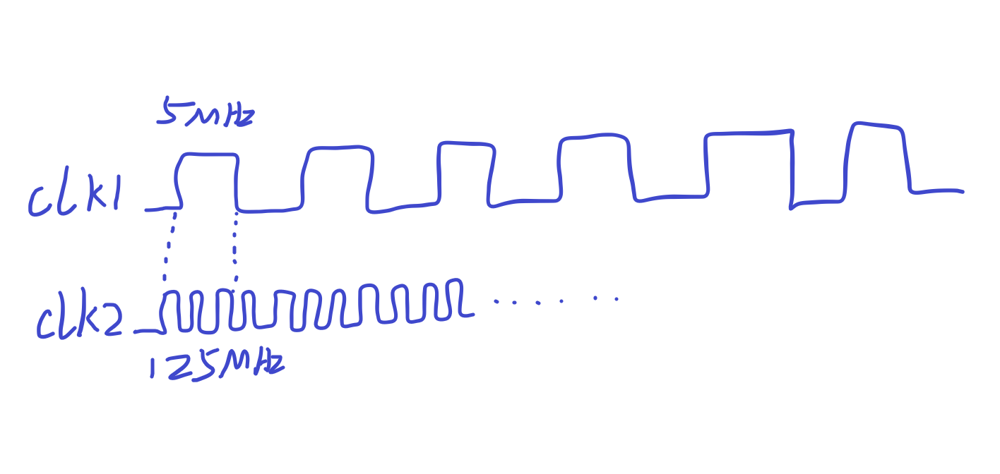

==================
随机赋值电压的输出
==================

预期目标：
 1. 连续输出设定的多个电压值
 2. 输出频率满足预设
 3. 电压值为随机输出
 4. 由FPGA完成上述工作

------------------------------------------------------------

目标选型
=================

 ————要完成预期目标必须要有基础支撑，设备型号的正确选择是高效完成目标的前提和基础

完成本目标我的选型如下：
 1. FPGA选型 —— 黑金FPGA开发板-AX530 (CycloneIV EP4CE30)
 
 .. note::
  .. image:: ./fpga.jpg
    :width: 400px
  此型号FPGA的板内资源如图所示，足以胜任本目标的完成。

  官网报价：RMB-1299 链接：`AX530 <https://detail.tmall.com/item.htm?spm=a230r.1.14.6.632f5a7fhbWb7E&id=548163665175&cm_id=140105335569ed55e27b&abbucket=7>`_ 

 2. DAC模块选型 —— 黑金14位双通道DA模块-AN9767

 .. note::
  .. image:: ./dac.jpg

  此DAC模块是目前在黑金官网能够购买到的采样率最高的DA模块，DA更新速率高达 **125M-SPS**

 .. warning::
  怎样理解AD/DA模块的更新速率(或采样速率)：
   为了保证转换的正确完成，采样速率（Sample Rate）必须小于或等于转换速率。可以说转换速率是最大采样速率，\
   因此有人习惯上将转换速率在数值上等同于采样速率也是可以接受的。常用单位是KSPS或MSPS（1MSPS=1000KSPS）

   例如上述的125MSPS便是指：每秒钟的数模的采样数为125M个。
  怎样理解MSPS或KSPS和频率的关系：
   输出的频率需要联系到我们的需求，\
   我们将数据波形数据先写入ROM中，然后利用DA模块输出模拟信号

   以本型号的DA模块为例，假设ROM中存储的数据宽度为14bit，存储数据深度为1024。
   如果我们以1个周期采8个点来计算，那么1024的数据深度一共可以采 1024/8=128个周期的数据。然后再利用采样率125MSPS比上128即得到此时的输出频率为125M/128=15.6MHz
   1个周期内的采样点越多，因为ROM的数据深度固定，那么输出的频率就会越小。

------------------------------------------------------------

可行性分析
=================

 ——虽然上述的选型中描述了FPGA板的型号以及DA模块的型号，但是如何能够保证目标顺利完成还需要有 **算法** 的帮助

我在此采用的思想是：
 1. 利用FPGA内嵌的 **ROM** 预存多值电压的数据，因为 **ROM** 的特点是掉电数据不丢失，所以只要预先将我们需要的电压值写入ROM即可
 2. 利用多选一数据选择器的思想，随机的选择ROM中的哪一些地址段的数据
 3. 通过DA将选择的地址端的数据输出

.. note::
 **思想来源**
  
  使用这个方法是我在查看AN9767的用户手册中想到的，在手册中给出了如何将存储在ROM中的正弦波数据通过DA模块输出到示波器上。
  所以我这个思想是在它的基础上构建而成，具有可行性！
  
  :download:`下载AN9767用户手册 <AN9767REV1.0.pdf>`

------------------------------------------------------------

具体实施
=================

如图所示，这是此设计的大致模型图：
 1. 由PLL锁相环生成高频的时钟
 2. 由SEL数据选择器选择不同的地址位
 3. 由PLL和SEL共同作用，使ROM中的数据输出
 4. ROM的数字信号通过AN9767转换成模拟信号
 5. 通过BNC线连接示波器显示

下面分别介绍一下，各个模块的具体实现

预设电压值
--------------------

预设电压值，需要用到工具——**波形数据生成器**

操作步骤如下：
 1. 双击exe文件打开该工具
 2. 点击 **查看 --> 全局参数**，设置为如下：
  .. image:: ./canshu.PNG
   :width: 200
 3. 设置后能立即看到网格图发生了变化
 4. 点击 **查看 --> 数据曲线**，设置后便能看到波形曲线
 5. 点击 **手绘波形 --> 线条**，此时切换到手绘模式
 6. 手动在图中绘制想要设置的波形
 7. 点击 **保存** 选择合适位置保存即可（默认保存为.mif文件）

下图是我设置的电压值的缩略图：

由图可以看到，我手绘了4个不同高度的电压值。
通过记事本打开保存的.mif文件，可以看到图形其实是由这些十六进制数据保存在文件中的

 .. image:: ./image_v_dig.png
  :width: 200px

参考下载：
 :download:`波形生成器 <Guagle_wave.exe>`

 :download:`参考.mif文件 <four_v.mif>`

数据选择器
--------------------

选择器的原理很简单，利用A\ :sub:`1`\ A\ :sub:`0`\ 的数据选择特性选择不同的输出

=========================================== ===========
选择输入：A\ :sub:`1`\ A\ :sub:`0`\          输出 F
------------------------------------------- -----------
00                                          D\ :sub:`0`\
------------------------------------------- -----------
01                                          D\ :sub:`1`\
------------------------------------------- -----------
10                                          D\ :sub:`2`\
------------------------------------------- -----------
11                                          D\ :sub:`3`\
=========================================== ===========

选择波形如上，利用频率差进行选择。

电压随机的原理是利用频率差，因为目前所用的AN9767的DAC板的最高采样率为125Mbps，然后再利用一个低频率为5MHz的选择波形去选择125MHz的输出波形（这时一个周期的采样点为125/5 = 25 个），
最后得到的理想输出频率应该和低频率一致为5MHz，但是由于实际环境及电路的影响，最后输出的波形频率为1.4 ~ 2MHz。这也是之前测试的结果。 这里为什么会选5MHz 和 125 MHz。
因为DAC模块的最高能够识别的频率就为125MHz，频率再高也只能识别为125MHz。低频率选择为5MHz的原因是由于采样点的问题，如果一个周期的采样点取少了（例如取5个或者10个）会导致出来的电压波形不是一个平顶，
而是一个尖峰。 通常使用的正弦波或者其他波形的采样点都是一个周期里1024个采样点。所以这里的25个已经是我测试的这么多次里面最低且满足效果的了，如果采样点再减少则波形无法满足预设要求。

具体实现的verilog代码如下 ::

    module mux( d1, d2, d3, d4, sel, dout);
        
        input d1;
        input d2;
        input d3;
        input d4;
        input [1:0] se1;
        
        output out;
        reg out;
        
        always @(d1 or d2 or d3 or d4 or sel)
        
        case({sel})
            2'b00 : out = d1;
            2'b01 : out = d2;
            2'b10 : out = d3;
            2'b11 : out = d4;
        endcase

    endmodule
 
上面就是简单的数据选择器的实现代码，在我的方法中就采用了这种思想，但不是生搬硬套得将上述的代码直接copy进去，
而仅是采用通过输入选择输出的这种思想，如果你还不是很明白，那么我在下面会详细说明。

ROM和PLL的IP核设置
--------------------

ROM IP核设置如下：

 1. 在 *Quartus II* 中，点击 **Tool --> MegaWizard Plug-In Manager** 在弹出的窗口选择第一项 *Create a new custom megafunction variation*
 2. 在左侧中选择 **ROM:1-PORT**, 再在 *output file* 栏里输入IP的名称以及存放IP的目录，语法选择Verliog
 3. 设置 ROM 的数据宽度为14bits,数据的深度为1024个数据，如下图红框所示
  .. image:: ./rom1.png
   :width: 300px
 4. 中间的步骤默认点击 *next* 即可，直到到达下图页面，设置之前保存好的mif文件
   .. image:: ./rom2.PNG
    :width: 300px
 5. 继续点击 *next* 直到最后，点击 **Finish**，这样一个ROM的IP核就设置完成
 
设置完成后，能在 *Quartus II* 中查看到设置好的IP核，如果想改动参数，直接双击即可再次进入设置流程重新设置

PLL IP核设置如下：

 1. 在 *Quartus II* 中，点击 **Tool --> MegaWizard Plug-In Manager** 在弹出的窗口选择第一项 *Create a new custom megafunction variation*
 2. 在左侧窗口的I/O文件夹下选择 **ATLPLL**, 再在 *output file* 栏里输入IP的名称以及存放IP的目录，语法选择Verliog
 3. 首先设置开发板上的基础时钟以及位数，模式选择普通模式即可，如下图红框所示
  .. image:: ./pll.png
   :width: 300px
 4. 中间的步骤点击 *next* 即可，直到到达下图页面，此处点击红框，然后手动输入想要PLL输出的频率，如下图所示：
   .. image:: ./pll2.png
    :width: 300px
 5. 如果想要继续设置多个输出，则在第4步设置完成后，点击next，接着重复第4步的工作即可。本型号的FPGA板可支持4个PLL输出
 6. 如果只想设置1个或者几个输出，在设置完后直接点击Finish即可

 
.. warning::
 上述IP核的设置过程，仅针对目前的项目。如有其它需求或想深入了解还请参考 `ROM及PLL的IP核设置详解 <https://www.cnblogs.com/huangsanye/p/5257119.html>`_

代码的形成
--------------------

 ————代码的实现不是一蹴而就的，而是前面步骤的积累，自然而然产生的结果

总体实现verilog代码(只展示顶层文件代码) ::

    module random_v(clk, da1_clk, da1_wrt, da1_data, da2_clk, da2_wrt, da2_data); 

        input clk, 
        output da1_clk, 
        output da1_wrt, 
        output [13:0] da1_data,
        output da2_clk, 
        output da2_wrt, 
        output [13:0] da2_data 

        reg [9:0] rom_addr; 
        wire [13:0] rom_data; 
        wire clk_50; 
        wire clk_125; 
        
        
        assign da1_clk=clk_125; 
        assign da1_wrt=clk_125;
        assign da1_data=rom_data; 
        
        assign da2_clk=clk_125; 
        assign da2_wrt=clk_125; 
        assign da2_data=rom_data; 
        
    always @(posedge clk_125) 
    begin
        if(sel[4:3] == 2'b00) 
            begin
                if(10'd0 <= rom_addr <= 10'd255) 
                begin
                rom_addr <= rom_addr + 1'b1 ; 
                end
                else begin
                rom_addr <= 10'd0;
            end 
        end
        
        else if(sel[4:3] == 2'b01) begin
        if(10'd256 <= rom_addr <= 10'd511) begin
            rom_addr <= rom_addr + 1'b1;
            else begin
            rom_addr <= 10'd256;
            end 
        end
        
        else if(sel[4:3] ==2'b01) begin
        if(10'd512 <= rom_addr <= 10'd767) begin
            rom_addr <= rom_addr + 1'b1; 
            end
            else begin
            rom_addr <= 10'd512;
            end 
        end
        
        else begin
        if(10'd768 <= rom_addr <= 10'd1023) begin
            rom_addr <= rom_addr + 1'b1;
            end
            else begin
            rom_addr <= 10'd768;
            end 
        end   
    end

    wire div_out;
    div_f	div_f_inst(
            .clk(clk),
            .div_out(div_out)
            );

    wire qq;
    wire load;
    sample sample_inst(
                .d(clk_125),
                .clk(div_out),
                .load(load),
                .qq(qq)
    );
    wire [2:0] sel;                  
    RanGen RanGen_inst(
                .clk (clk),
                .load(load),
                .seed(qq),
                .sel (sel)  
    );
    
    ROM ROM_inst (
                .clock   (clk_125),
                .address (rom_addr), 
                .q       (rom_data)
    ); 
    
    pll pll_inst( 
                .areset  (1'b0),
                .inclk0  (clk),
                .c0      (clk_50), 
                .c1      (clk_125),
                .locked  ()  
    ); 
 
 endmodule

上面的代码是针对每个模块的例化，其中包括对ROM、PLL的IP核文件的例化，对伪随机发生器、分频器的例化。\
因为上述为硬件描述性语言verilog，而本文档支持的编程语言为python，由于语法冲突故没有在上述代码添加注释。

参考下载： 

:download:`verilog完整程序 <verilog_test.rar>`

-----------------------------------------

小结
============================

 ————本节主要谈谈个人经验

当我面对这个问题时，首先也很困惑，同时在网上搜索也没有相关的内容，唯一搜索到的几个还都是专利。
此刻我的内心是这样的：

但是人不能被困难吓倒，所以在经历挣扎后，我从FPGA的例程入手，一步一步剖析，边学习verilog边思考实现的模型。

..

      “加油！”

      — adapt

