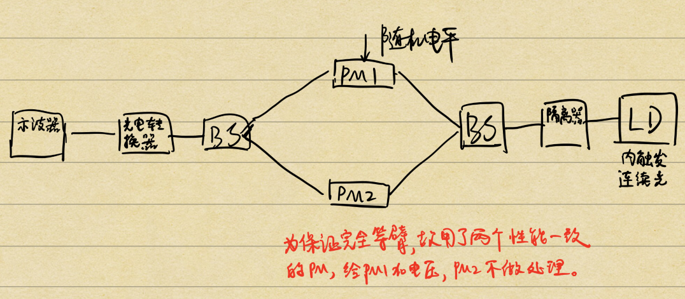
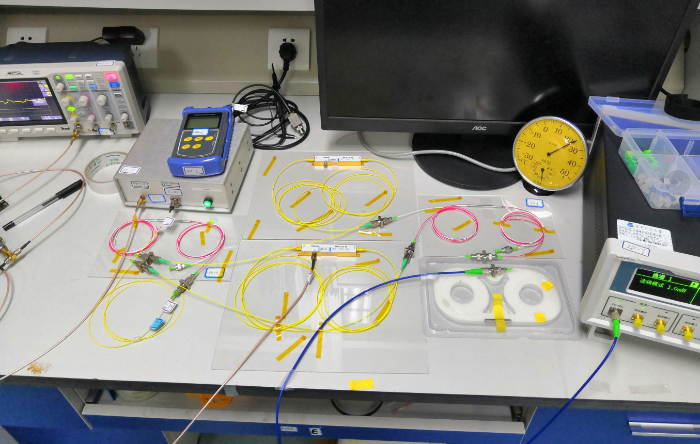
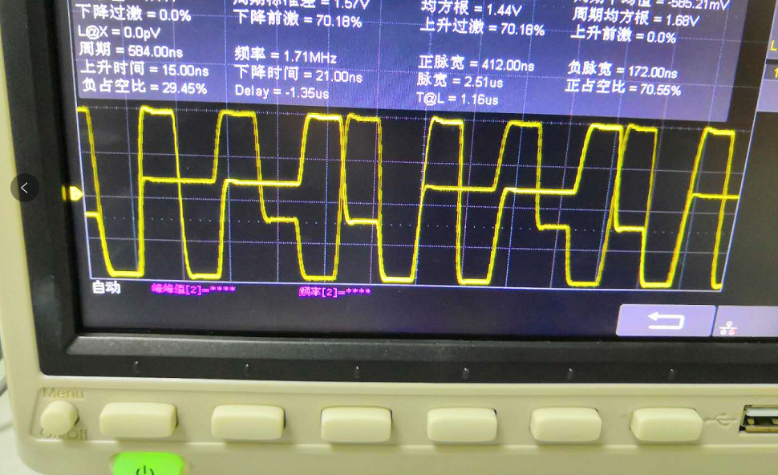
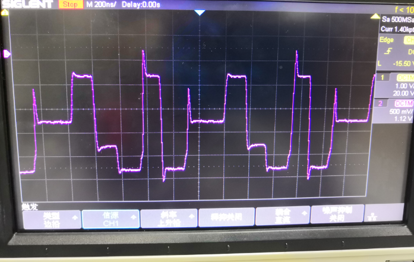
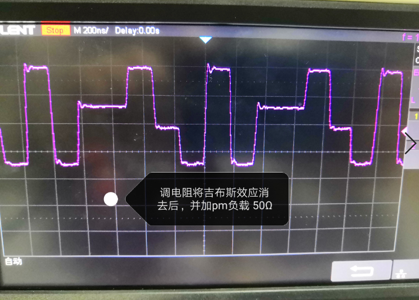
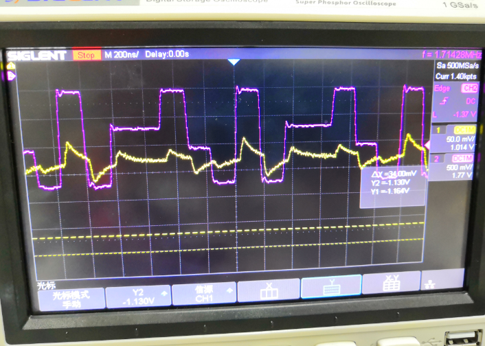

============
随机电压系统带载性能测试
============

1. 实验名称
=============
实验名称： 利用FPGA输出随机电压的负载带载能力验证实验

FPGA输出随机电压，将随机电压输入给PM的SMA接口并在示波器上观察通过光电转换后的电信号是否符合预期

2. 实验目的
=============
实验目的： 验证带载能力（是否能够带载IM以及PM）

验证此目的是为以后做关于调制解调等方面工作打下基础（可基于需要在现有工作上做修改即可）。

3. 实验步骤
=============

3.1 绘制原理框图
-------------

3.2 实验仪器设备选用
-------------

    1. 激光器： 选用问天的激光器（内调制，1mW，连续光输出）
    2. 隔离器
    3. PM： 选用网站上的PM-10、PM-12两个参数相近的PM（为保证严格等臂，使用两个但只对其一输入随机电平）
    4. BS： 选用编号为 BS-3、BS-4
    5. 光电转换器

3.3 实验平台搭建
-------------

搭建过程中，利用手持光功率计查看功率是否符合预期值。

3.4 实验现象
-------------

图1. 未接负载时，随机电平的示波器波形

图2. 接上PM负载后，随机电平的示波器波形

图3. 调节DA板上的滑动变阻器旋钮，消去吉布斯效应后，随机电平的示波器波形

------------

图4. 随机电平调制后的光信号（已经过光电转换）

紫色的波形是随机电平的波形，黄色的波形是光信号经过等臂PM后经光电转换出来的波形。
虽然黄色的波形不是平顶的（一方面可能受随机电平的影响，也由于本验证实验没有加PC，所以出来的黄色波形不是特别好），但是它的变化趋势是和随机电平的变化趋势是一样的

3.5 实验结论
-------------

以上实验可以看出本项目的FPGA输出的随机电平信号是具有带载PM的能力的

但是还需要改进的点有：
 
 1. 提高随机电平的随机性
 2. 提高随机电平的输出频率
 3. 提高随机电平的输出电压

