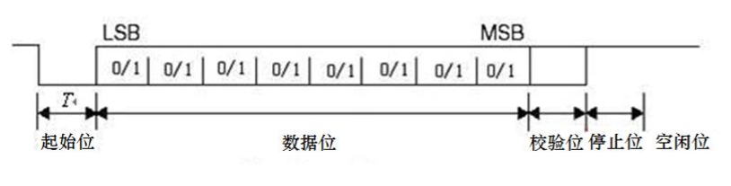

==================
关于联合测试的资料整理
==================

由于之前实现PC与FPGA的通信是借助了示例中提供的工具，虽然能够实现通信，但是那样带来的弊端是十分缺乏稳定性和保密性，故基于此缺点，我决定绕过
这个中间工具，自己独立开发一套适用于与FPGA通信的代码。

为此我决定比较不同的通信模式的优劣势以及实现上的性价比

1. UART通信
==============

.. note::

    UART是一种异步收发传输器，骑其在数据发送时将并行数据转换为串行数据来传输，
    在数据接收时将接收到的串行数据转换成并行数据，可以实现全双工传输和接收。
    在FPGA开发板设计中，UART用来与PC进行通信，包括数据通信，命令和控制信息的传输。

1.1 Uart的通信协议和传输时序
--------------

 UART通信： 
  
  1. UART首先将接收到的并行数据转换成串行数据来传输。消息帧从一个低位起始位开始，后面是7个或8个数据位，然后是一个可用的奇偶位和一个或几个高位停止位
  #. 接收器发现开始位时它就知道数据准备发送，并尝试与发送器时钟频率同步
  #. 如果选择了奇偶校验，UART就在数据位后面加上奇偶位。奇偶位可用来帮助错误校验
  #. 在接收过程中，UART从消息帧中去掉起始位和结束位，对进来的字节进行奇偶校验，并将数据字节从串行转换成并行

传输时序图如图所示：

