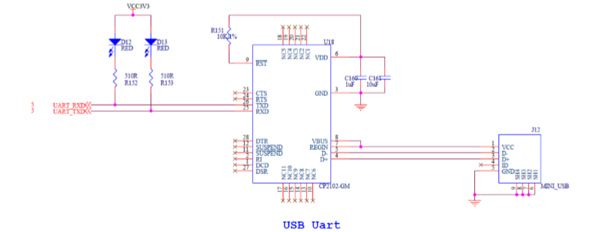
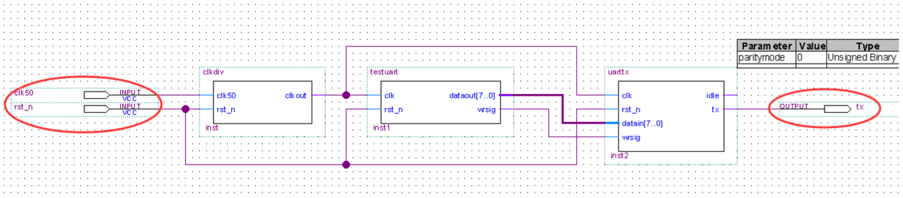
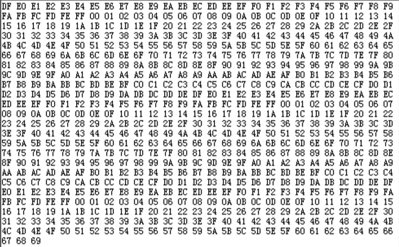
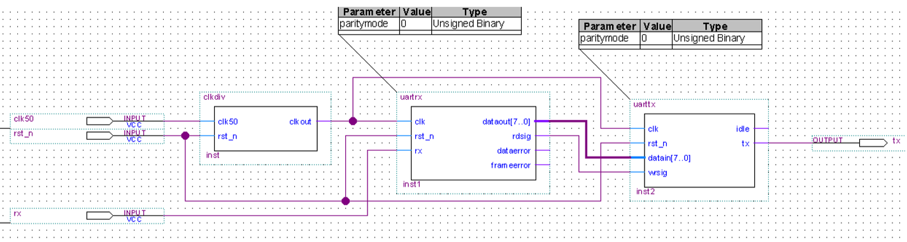
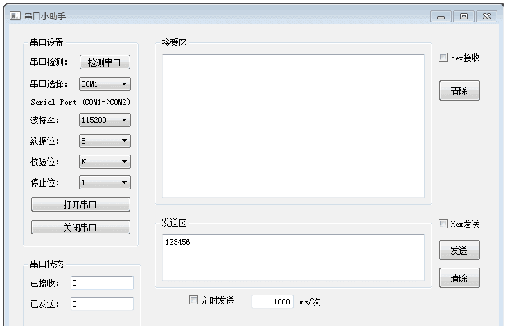

==================
关于联合测试的资料整理
==================

由于之前实现PC与FPGA的通信是借助了示例中提供的工具，虽然能够实现通信，但是那样带来的弊端是十分缺乏稳定性和保密性，故基于此缺点，我决定绕过
这个中间工具，自己独立开发一套适用于与FPGA通信的代码。

为此我决定比较不同的通信模式的优劣势以及实现上的性价比

1. 利用UART实现通信
==============

.. note::

    UART是一种异步收发传输器，骑其在数据发送时将并行数据转换为串行数据来传输，
    在数据接收时将接收到的串行数据转换成并行数据，可以实现全双工传输和接收。
    在FPGA开发板设计中，UART用来与PC进行通信，包括数据通信，命令和控制信息的传输。

1.1 UART通信过程
----------------

  1. UART首先将接收到的并行数据转换成串行数据来传输。消息帧从一个低位起始位开始，后面是7个或8个数据位，然后是一个可用的奇偶位和一个或几个高位停止位
  #. 接收器发现开始位时它就知道数据准备发送，并尝试与发送器时钟频率同步
  #. 如果选择了奇偶校验，UART就在数据位后面加上奇偶位。奇偶位可用来帮助错误校验
  #. 在接收过程中，UART从消息帧中去掉起始位和结束位，对进来的字节进行奇偶校验，并将数据字节从串行转换成并行

传输时序图如图所示：

.. image:: ./uart.png

1.2 硬件介绍
--------------

AX530开发板上含有UART串口用于开发板与PC间的串口通信。串口原理图如下图所示：

其中 UART_RXD为PC-->FPGA的串行数据，UART_TXD为PFGA-->PC的串行数据

.. warning::

  USB转UART需要安装相应的驱动，这些驱动程序 允许CP2102 USB-UART桥接设备在通信应用软件显示为一个COM端
  驱动是否安装成功，可以在设备管理器下查看

1.3 串口发送程序模块设计(由FPGA发送给PC) 
-------------

针对本项目，并且基于示例程序，我设计了适合本项目的用于通信的UART程序模块，共分为3个部分：

    1. **时钟产生程序** ：用于产生发送数据的时钟频率，需要针对相应的波特率做修改
    2. **uart串口发送程序** ：通过串口在时钟到来时将数据发送出去
    3. **uart串口发送测试程序** ：用于测试串口发送的数据是否正确

1.3.1 时钟产生程序
^^^^^^^^^^^^^^

时钟产生程序verilog代码::

    `timescale 1ns / 1ps
    //////////////////////////////////////////////////////////////////////////////////
    // Module Name:    clkdiv  
    ////////////////////////////////////////////////////////////////////////////////// 
    
    module clkdiv(clk50, rst_n, clkout); 
    input clk50;              //系统时钟 50MHz
    input rst_n;              //收入复位信号 
    output clkout;            //采样时钟输出 
    reg clkout; 
    reg [15:0] cnt; 
 
    /////分频进程, 50Mhz的时钟28分频//////////
    /////50Mhz÷(16*波特率)=分频数
    /////50M÷(16*115200)=27.1267≈28
    /////波特率：每秒钟通过信道传输的码元数称为码元传输速率
    /////波特率是传输通道频宽的指标,本程序中 数据的传输频率为115200÷16 = 7200个8位数据信号/s

    always @(posedge clk50 or negedge rst_n)
        begin
        if (!rst_n) begin // 初始化+给初值
                clkout <=1'b0;
                cnt<=0;   
            end
            else if(cnt == 16'd13) begin
                clkout <= 1'b1;     
                cnt <= cnt + 16'd1;   
            end
            else if(cnt == 16'd27) begin // 因为是从0开始计数，所以此处为27
                clkout <= 1'b0;
                cnt <= 16'd0;
            end
            else begin
                cnt <= cnt + 16'd1;
            end
        end
    endmodule

对于程序中提到的波特率，可由下图确定：

.. imange:: ./bote.png

右图可看出，波特率从4800bps/s开始，之后的波特率都是4800的倍数，以此类推。

串口通讯，主从双方波特率必须一致才能有效传递数据，9600是使用最多的一个波特率，所以默认状态下一般都是设置成9600。
对于串口通讯而言，波特率越高，有效传输距离越小，而9600这个波特率，兼顾了传输速度和常用传输距离，一般为10米左右，最大不超过20米。
如果为115200，一般距离不超过5米。常用2~3米左右。
上述采用波特率为115200进行传输，在保证了传输距离的情况下尽可能增加传输速度

1.3.2 uart串口发送程序
^^^^^^^^^^^^^^

串口发送程序::

    `timescale 1ns / 1ps
    ////////////////////////////////////////////////////////////////////////////////// 
    // Module Name: uarttx  
    // 说明：16个clock上升沿发送一个bit(即8位二进制数据)
    //      16个clock时钟中的操作：一个起始位 + 8个数据位 + 一个奇偶校验位 + 一个停止位 + 剩余的空缺位
    ////////////////////////////////////////////////////////////////////////////////// 
    
    module uarttx(clk, rst_n, datain, wrsig, idle, tx); 
    
    input clk;                //UART时钟，由时钟产生模块给出 
    input rst_n;              //系统复位
    input [7:0] datain;       //需要发送的数据 
    input wrsig;              //发送命令，上升沿有效 
    output idle;              //线路状态指示，高为线路忙，低为线路空闲 
    output tx;                //发送数据信号 
    
    reg idle, tx; 
    reg send; 
    reg wrsigbuf, wrsigrise; 
    reg presult; 
    reg[7:0] cnt;             //计数器 
    parameter paritymode = 1'b0; 
    
    //////////////////////////////////////////////////////////////// 
    //检测发送命令wrsig的上升沿 
    //////////////////////////////////////////////////////////////// 
    
    always @(posedge clk) 
    begin
        wrsigbuf <= wrsig;
        wrsigrise <= (~wrsigbuf) & wrsig;
    end 
    
    //////////////////////////////////////////////////////////////// 
    //启动串口发送程序 
    //////////////////////////////////////////////////////////////// 
    
    always @(posedge clk) 
    begin
    if (wrsigrise && (~idle))  //当发送命令有效且线路为空闲时，启动新的数据发送进程
        begin
            send <= 1'b1;   
        end   
        else if(cnt == 8'd168)      //一帧数据发送结束，这里的168指代一帧数据走完需要经过的上升沿个数
        begin
            send <= 1'b0;
        end 
    end 
    
    //////////////////////////////////////////////////////////////// 
    //串口发送程序, 16个时钟发送一个bit 
    //////////////////////////////////////////////////////////////// 
    always @(posedge clk or negedge rst_n) 
    begin
        if (!rst_n) 
        begin
            tx <= 1'b0;          
            idle <= 1'b0;
            cnt <= 8'd0;    
            presult <= 1'b0;   
        end    
        
        else if(send == 1'b1)  
        begin
            case(cnt)                 //产生起始位
                8'd0: 
                    begin
                        tx <= 1'b0;  //给入低位触发，即将传输数据     
                        idle <= 1'b1;          
                        cnt <= cnt + 8'd1;     
                    end     
                8'd16:
                    begin          
                        tx <= datain[0];    //发送数据0位          
                        presult <= datain[0]^paritymode;          
                        idle <= 1'b1;          
                        cnt <= cnt + 8'd1;
                    end     
                8'd32:
                    begin 
                        tx <= datain[1];    //发送数据1位          
                        presult <= datain[1]^presult;          
                        idle <= 1'b1;          
                        cnt <= cnt + 8'd1;     
                    end     
                8'd48:
                    begin          
                        tx <= datain[2];    //发送数据2位          
                        presult <= datain[2]^presult;          
                        idle <= 1'b1;          
                        cnt <= cnt + 8'd1;     
                    end     
                8'd64: 
                    begin          
                        tx <= datain[3];    //发送数据3位          
                        presult <= datain[3]^presult;          
                        idle <= 1'b1;          
                        cnt <= cnt + 8'd1;     
                    end     
                8'd80: 
                    begin           
                        tx <= datain[4];    //发送数据4位          
                        presult <= datain[4]^presult;          
                        idle <= 1'b1;          
                        cnt <= cnt + 8'd1;     
                    end     
                8'd96: 
                    begin
                        tx <= datain[5];    //发送数据5位          
                        presult <= datain[5]^presult;          
                        idle <= 1'b1;          
                        cnt <= cnt + 8'd1;     
                    end     
                8'd112: 
                    begin
                        tx <= datain[6];    //发送数据6位          
                        presult <= datain[6]^presult;          
                        idle <= 1'b1;          
                        cnt <= cnt + 8'd1;     
                    end     
                8'd128: 
                    begin           
                        tx <= datain[7];    //发送数据7位          
                        presult <= datain[7]^presult;          
                        idle <= 1'b1;          
                        cnt <= cnt + 8'd1;     
                    end     
                8'd144: 
                    begin          
                        tx <= presult;      //发送奇偶校验位          
                        presult <= datain[0]^paritymode;          
                        idle <= 1'b1;
                        cnt <= cnt + 8'd1;     
                    end     
                8'd160: 
                    begin 
                        tx <= 1'b1;         //发送停止位                      
                        idle <= 1'b1;          
                        cnt <= cnt + 8'd1;     
                    end     
                8'd168: 
                    begin  
                        tx <= 1'b1;                       
                        idle <= 1'b0;       //一帧数据发送结束          
                        cnt <= cnt + 8'd1;     
                    end     
                default:
                    begin          
                        cnt <= cnt + 8'd1;  //cnt只要不等于16的倍数就自加1，即是16个时钟上升沿对应发送一位数据    
                    end    
            endcase   
        end   
        else  
        begin     
            tx <= 1'b1;  // 一帧数据传完，置高位  
            cnt <= 8'd0; // 一帧传完数据又重置cnt
            idle <= 1'b0; // 线路状态指示为低，表示线路空闲
        end 
    end 
    endmodule 

1.3.3 uart串口发送测试程序
^^^^^^^^^^^^^^

串口测试程序verilog代码::

    `timescale 1ns / 1ps 
    ///////////////////////////////////////////////////////
    // Module Name: testuart  
    ///////////////////////////////////////////////////////
    
    module testuart(clk, rst_n, dataout, wrsig); 
    input clk; 
    input rst_n; 
    output[7:0] dataout; 
    output wrsig; 
    reg [7:0] dataout; 
    reg wrsig;
    reg [7:0] cnt;
    always @(posedge clk or negedge rst_n) 
    begin
        if(!rst_n) 
        begin
            cnt<=8'd0;   
            wrsig<=1'b0;   
        end   
        else 
        begin      
            if(cnt == 254)              
                begin    
                    dataout <= dataout + 8'd1;  // 每次数据加“1”    
                    wrsig <= 1'b1;              // 产生发送命令    
                    cnt <= 8'd0;    
                end    
            else    
            begin    
                wrsig <= 1'b0;    
                cnt <= cnt + 8'd1;    
            end   
        end    
    end 
    endmodule

串口测试程序产生串口发送的数据(0~0xFF)和发送命令信号给串口发送模块请求发送

1.3.4 顶层文件实现
^^^^^^^^^^^^^^

编写好3个verilog串口发送程序模块后,新建一个名为uart_tx的工程并把这3个verilog程序添加到项目中,再依次右键点击这3个程序文件把它们转化为原理图的symbol
然后利用Quartus II的顶层文件原理图功能来实现该项目的顶层文件。

点击菜单File->New....再选择Block Diagram/Schematic File来打开一个原理图设计文件:

用导线连接各个模块如下图所示，其中testuart的dataout[7..0]和uarttx的datain[7..0]之间用Diagonal Bus Tool连接; 
其它的线用Diagonal Node Tool连接。

修改完后保存为uart_tx.bdf文件并设置为Top程序。再编译整个项目，编译成功后，打开Pin Planner进行FPGA的管脚和IO电压的配置。

1.3.5 串口发送数据的测试
^^^^^^^^^^^^^^

用USB线连接PC和开发板的J12，打开串口调试助手。在串口调试助手里把端口号设置为我们前面在设备管理器中看到的端口号(即COM号)，设置波特率为115200, 校验位不需要设置，停止位为1。
下载项目的 uart_tx.sof 文件到开发板，我们可以在串口工具的窗口上看到从FPGA开发板不断发给PC的从0到FF的16进制的测试数据。
如下图所示：

1.4 串口接收程序模块设计(由FPGA接收PC的数据)
----------
   -----实现并验证了串口发送程序后，可以编写串口的接收程序

UART接收模块的Verilog HDL 语言代码如下::
 
    ////////////////////////////////////////////////////////////////////////////////// 
    // Module name    uartrx.v 
    // 说明：16个clock接收一个bit，16个时钟采样，取中间的采样值 
    ////////////////////////////////////////////////////////////////////////////////// 
    
    module uartrx(clk, rst_n, rx, dataout, rdsig, dataerror, frameerror); 
    input clk;             //采样时钟 
    input rst_n;           //复位信号 
    input rx;              //UART数据输入 
    output dataout;        //接收数据输出 
    output rdsig; 
    output dataerror;      //数据出错指示 
    output frameerror;     //帧出错指示 
    
    reg[7:0] dataout; 
    reg rdsig, dataerror; 
    reg frameerror; 
    reg [7:0] cnt; 
    reg rxbuf, rxfall, receive; 
    parameter paritymode = 1'b0; 
    reg presult, idle; 
    
    always @(posedge clk)   //检测线路的下降沿 
    begin   
        rxbuf <= rx;   
        rxfall <= rxbuf & (~rx); 
    end 
    
    ////////////////////////////////////////////////////////////////
    //启动串口接收程序 
    //////////////////////////////////////////////////////////////// 
    
    always @(posedge clk) 
    begin
        if (rxfall && (~idle)) 
        begin//检测到线路的下降沿并且原先线路为空闲，启动接收数据进程
            receive <= 1'b1;   
        end   
        else if(cnt == 8'd168) 
        begin //接收数据完成     
            receive <= 1'b0;   
        end 
    end 
    
    //////////////////////////////////////////////////////////////// 
    //串口接收程序, 16个时钟接收一个bit 
    //////////////////////////////////////////////////////////////// 
    always @(posedge clk or negedge rst_n) 
    begin
    if (!rst_n) 
        begin 
            idle<=1'b0;    
            cnt<=8'd0;      
            rdsig <= 1'b0;      
            frameerror <= 1'b0;     
            dataerror <= 1'b0;       
            presult<=1'b0;   
        end      
    else if(receive == 1'b1) 
        begin   
            case (cnt)   
                8'd0:
                    begin    
                        idle <= 1'b1;    
                        cnt <= cnt + 8'd1;    
                        rdsig <= 1'b0;   
                    end   
                8'd24:
                    begin                 //接收第0位数据    
                        idle <= 1'b1;    
                        dataout[0] <= rx;    
                        presult <= paritymode^rx;    
                        cnt <= cnt + 8'd1;    
                        rdsig <= 1'b0;   
                    end   
                8'd40:
                    begin                 //接收第1位数据      
                        idle <= 1'b1;    
                        dataout[1] <= rx;    
                        presult <= presult^rx;   
                        cnt <= cnt + 8'd1;    
                        rdsig <= 1'b0;   
                    end   
                8'd56:
                    begin                 //接收第2位数据       
                        idle <= 1'b1;    
                        dataout[2] <= rx;    
                        presult <= presult^rx;    
                        cnt <= cnt + 8'd1;    
                        rdsig <= 1'b0;   
                    end   
                8'd72:
                    begin               //接收第3位数据       
                        idle <= 1'b1;    
                        dataout[3] <= rx;    
                        presult <= presult^rx;    
                        cnt <= cnt + 8'd1;    
                        rdsig <= 1'b0;   
                    end   
                8'd88:
                    begin               //接收第4位数据        
                        idle <= 1'b1;    
                        dataout[4] <= rx; 
                        presult <= presult^rx;    
                        cnt <= cnt + 8'd1;    
                        rdsig <= 1'b0;   
                    end   
                8'd104:
                    begin            //接收第5位数据        
                        idle <= 1'b1;    
                        dataout[5] <= rx;    
                        presult <= presult^rx;    
                        cnt <= cnt + 8'd1;    
                        rdsig <= 1'b0;   
                    end   
                8'd120:
                    begin            //接收第6位数据        
                        idle <= 1'b1;    
                        dataout[6] <= rx;    
                        presult <= presult^rx;    
                        cnt <= cnt + 8'd1;    
                        rdsig <= 1'b0;   
                    end   
                8'd136:
                    begin            //接收第7位数据       
                        idle <= 1'b1;    
                        dataout[7] <= rx;    
                        presult <= presult^rx;    
                        cnt <= cnt + 8'd1;    
                        rdsig <= 1'b1;   
                    end   
                8'd152:
                    begin            //接收奇偶校验位        
                        idle <= 1'b1;    
                        if(presult == rx)      
                            dataerror <= 1'b0;    
                        else     
                            dataerror <= 1'b1;       //如果奇偶校验位不对，表示数据出错    
                        cnt <= cnt + 8'd1;    
                        rdsig <= 1'b1;   
                    end   
                8'd168:
                    begin     
                        idle <= 1'b1;     
                        if(1'b1 == rx)     
                            frameerror <= 1'b0;     
                        else     
                            frameerror <= 1'b1;      //如果没有接收到停止位，表示帧出错     
                        cnt <= cnt + 8'd1;     
                        rdsig <= 1'b1;   
                    end   
                default: 
                    begin    
                        cnt <= cnt + 8'd1; 
                    end   
            endcase    
        end     
    else 
    begin    
        cnt <= 8'd0;    
        idle <= 1'b0;    
        rdsig <= 1'b0;    
    end 
end 
endmodule 

.. note:: 

    接收数据过程：空闲状态，线路处于高电位；当检测到线路的下降沿（线路电位由高电位变为低电位）时说明线路有数据传输，
    按照约定的波特率从低位到高位接收数据，数据接收完毕后，接着接收并比较奇偶校验位是否正确，如果正确则通知后续设备准备接收数据或存入缓存。
    由于UART是异步传输，没有传输同步时钟。为了能保证数据传输的正确性，UART采用16倍数据波特率的时钟进行采样。每个数据有16个时钟采样，取中间的采样值，以保证采样不会滑码或误码。
    一般UART一帧的数据位数为8，这样即使每个数据有一个时钟的误差，接收端也能正确地采样到数据。

1.4.1 顶层原理图设计
^^^^^^^^^^^^

这里我们重新新建一个工程为 uart_test, 再把 clkdiv.v, uarttx.v 和 uartrx.v 这３个文件添加到工程并转化成symbol文件。
再利用和上面同样的操作，利用Quartus II 的原理图功能实现一个原理图文件并命名为uart_test.bdf文件作为项目的顶层文件，设计好的原理图如下图所示

1.4.2 串口接收实验验证
^^^^^^^^^^^^

重新编译成功后，打开Pin Planner约束管脚以及电平，然后再次编译，通过后下载 uart_test.sof 文件到开发板。
打开串口调试助手，进行验证，在串口工具里发送一个字符串给FPGA开发板，我们这里发送“AX530 FPGA Board”，
在串口工具的接收窗口会马上显示“AX530 FPGA Board”，说明FPGA接收到PC串口发送的数据并马上发回给PC，FPGA的接收和发送模块与PC的串口通信正确。 

1.5 利用python实现串口调试助手
----------

上面的过程最后的验证操作都是利用了串口调试助手，如何绕过该助手将数据下发给FPGA，这个问题之前我思考了很久，发现自己走进了一个死胡同。
今天终于豁然开朗，调式助手工具是利用程序代码编写的，用python肯定也能够实现相应的功能，只要知道需要的操作，利用python的特性能够很快实现。

由于本项目原有代码是利用python2.X书写的，所以为了统一，此处也利用python2.X来实现

利用python实现串口调试助手的代码::
    
    # -*- coding: utf-8 -*-
    import serial

    #打开串口
    serialPort="COM3"   # 指定串口
    baudRate=9600       # 设置波特率
    
    ser=serial.Serial(serialPort,baudRate,timeout=0.5)  
    print "参数设置：串口=%s ，波特率=%d" %(serialPort,baudRate)

    #收发数据
    while 1: # 一直监听串口

        str = input("请输入要发送的数据: ")
        ser.write((str+'\n').encode())
        print(ser.readline()) # 接收数据 
        
    ser.close() # 关闭串口

上面是利用python实现串口通信的最简单的写法，还可以继续完善，比如校验位，停止位都可以进行设置。

上图是利用pyqt+python实现的一个串口调试助手界面，以后可以将此界面中的发送区隐藏使用自身产生的随机数，
然后将其也加入之前的软件界面中，这样就实现了一体化的自动化控制。

这是利用串口实现通信，利用网络调试助手同理也可以这样实现。