=============
04_做的其他工作
=============

1. 项目仪器选型
=============

基于项目的框图调研本项目需要使用到的设备仪器：

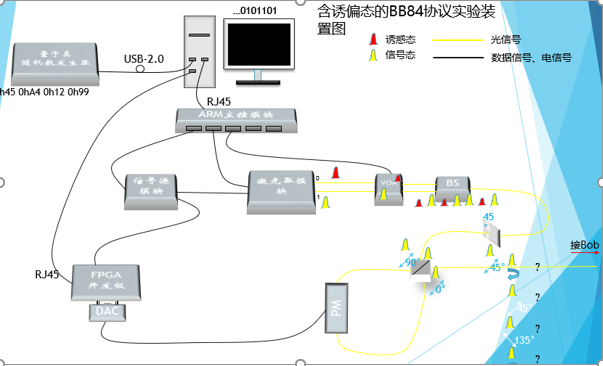

.. note::
    1. 图中关键设备在于ARM主控模块，它的作用是让PC通过以太网口与多个设备进行联系，以达到通信的目的
    2. 图中的VOA是受电信号的控制，这部分的实现可结合FPGA和光强度调制器完成
    3. 图中的信号源模块可以直接由FPGA的内时钟给定，其目的是所有时序的器件使用一个全局时钟

1.1 具体调研仪器设备
-------------

基于上述提到的ARM主控模板，其作用是通过PC的一个网口出来，能够连接控制多个设备。
具体形式可以参考国盾的该设备仪器：

.. image:: ./guodun_1.jpg

.. image:: ./guodun1.png

从上图中可以看出，该设备后部是由多个插槽组成的，将不同的硬件设备插入，通过插入网口后，即可在PC上进行控制。

1.1.1 以太网交换机
+++++++++++

通过以上的论述，要实现ARM主控模块同等的功能，即可以使用以太网交换机来实现。

.. note::
    交换机
    
    交换机Switch，工作在数据链路层（第二层），稍微高端一点的交换机都有一个操作系统来支持。和集线器一样主要用于连接计算机等网络终端设备。 
    交换机比集线器更加先进，允许连接在交换机上的设备并行通讯，好比高速公路上的汽车并行行使一般，设备间通讯不会再发生冲突，因此交换机打破了冲突域，交换机每个接口是一个冲突域，不会与其他接口发生通讯冲突。 
    并且有系统的交换机可以记录MAC地址表，发送的数据不会再以广播方式发送到每个接口，而是直接到达目的接口，节省了接口带宽。但是交换机和集线器一样不能判断广播数据包，会把广播发送到全部接口，所以交换机和集线器一样连接了一个广播域网络。 
    高端一点的交换机不仅可以记录MAC地址表，还可以划分VLAN（虚拟局域网）来隔离广播，但是VLAN间也同样不能通讯。要使VLAN间能够通讯，必须有三层设备介入。 

关于以太网交换机我在网上调研了一些大厂的产品，最终选定型号为：TP-Link TL-SG3210 8口千兆网管型网络交换机

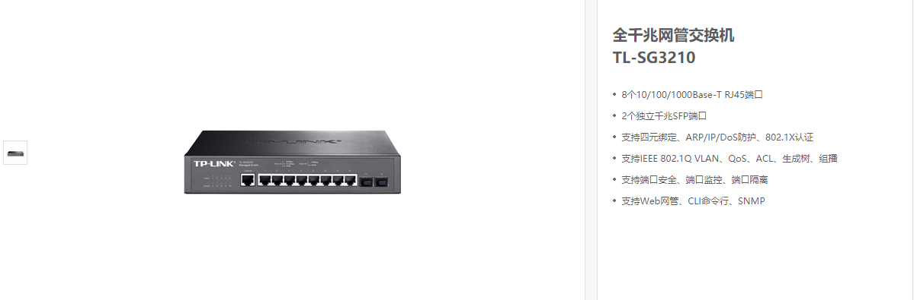

优势：背板宽带大，数据转发速度快；组网灵活，应用在大中型网络的接入层；支持VLAN划分，可以有针对性地对网络进行控制；网管型交换机的数据丢失率、延迟率低。

报价：499RMB（淘宝有售）

用途：让一台PC上位机能够和多台设备进行以太网通信

.. warning::
 使用交换机的难点是需要自己完成通信协议，通过一个通信协议使得PC和FPGA能够相互识别对面的数据含义。通过网口发送的数据是通过数据帧的形式发出，每一帧的数据中包含协议头信息+真正的数据信息+协议结束标志等信息。
 同时由于本项目是针对于多协议的，所以还需要在数据帧里区分不同的协议，以便让FPGA内部做出不同的操作。

1.1.2 标准型多路电控光衰减器
+++++++++++++++

在这里我调研了多款电控的光衰减器。具体有以下几种（点击可访问查看）：

 1. `华泰Huatai VOA500系列 <http://www.catvworld.net.cn/products/attenuator/voa700/index.htm>`_ （杭州华泰） 
 2. `微处理器补偿型数控MEMS衰减器 <http://www.quantum-info.com/product/coredevice/2017/0504/120.html>`_ （国盾量子）
 3. `OZ电控可调光衰减器 <http://www.rayscience.com/product-13480.html>`_ （瞬渺光电）

最后与杜聪协商，他建议利用IM替代电控光衰减器，一方面是实验室现有，第二是体积小，方便以后封装。

.. note::

 同时我也在网上查阅到：
 有些衰减器中的衰减是由电信号控制的，如果衰减调节非常快速，该器件实际上可以看做是光调制器（任意光学强度调制器都可以看做是可变衰减器）

并且在潘建伟小组的关于MDI的论文中也是利用IM串联的方式替代光衰减器，如下：

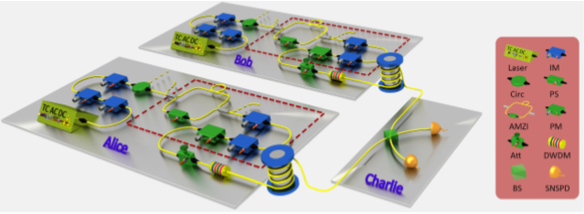

1.2 项目设备清单
-------------

    1.	激光器（已有 ，型号：QCL-102 皮秒脉冲激光器）
    2.	以太网交换机（需购入， 型号上述已给出）
    3.	PC（已有， 预装python软件的电脑即可）
    4.	FPGA板（已有，不过可能还需购入，型号：AX530）
    5.	强度调制器（已有，至少需要3个 型号：LN81S-FC）
    6.	分束器（已有，型号：BS-0x）
    7.	固定光衰减器（已有，型号SM3301，利用可编程光衰减器替代固衰）

1.3 实现难点
------------

整体项目的实现难点主要是以下几点：

 1. PC与以太网的交互协议需要自己编写，通过PC与硬件设备的自协商协议达到以太网通信的目的（这部分需要参考一些以太网通信的书籍）
 2. 如果验证诱骗态是否符合预期给定（① 利用强光的方法，在未衰减前检测诱骗态的占比 ② 利用单光子探测的方法，对于不同的平均光子数，对应区段的单光子计数不一样，不过这部分需要有能够从单光子探测器中取出对应计数的电路支持）
 3. 如果确定含诱骗态的准单光子源的起点位置（还需考虑，可以查阅其他文章或者专利是否有该问题的解决办法）

1.4 创新点整理
-------------

 1. 兼容多协议（BB84,COW）的系统方法
 2. 多路衰减器控制诱骗态平均光子数的方法
 3. 软硬件结合及自动化控制系统的方法
 4. 适用于多协议的软件内部处理创新算法

2. PC与FPGA的以太网通信
=====================

2.1 预期目标
-------------

 1. *FPGA* 和 *PC* 通过 *UDP* 协议通信
 2. 数据传输为单项传输， *PC* 发送，*FPGA* 接收
 3. 发送的数据为 *PC* 端制备的随机数

2.2 目标选型
-------------

目标选型具体阐述已在 :doc:`此部分 <random_voltage>` 给出，这里简单给出本节所用设备型号：
 1. *FPGA* -- 黑金 *AX530*
 2. *PC* -- *win10* 电脑
 3. 网线

2.3 通信方式
----------------

*PC* 如何与 *FPGA* 的通信方式有很多中，根据 *FPGA* 的型号而定，就本项目所使用的 *FPGA*(*AX530*)而言，通信方式不外乎有以下几种：
 1. 利用USB的串口通信 ———— 速度在百兆左右
 2. 利用以太网的网口通信 ———— 速度有百兆和千兆两个量级。
  .. note::
   其中由传输协议又细分为 *TCP* 协议和 *UDP* 协议
   
   *TCP* 协议需要使用多次握手确定双方的连接关系，是一种安全的通信方式，并且由于建立了通信双方的连接，
   故传输的数据不会丢失，缺点是速度较 *UDP* 协议慢
   
   *UDP* 协议是面向无连接的协议，即发送方只管发送信息，接收方只管接收信息。是一种适用于高速传输的场景中，例如：视频直播、网络游戏、聊天软件等都是利用了 *UDP* 协议。
   它会存在一定的丢包率，不过由于传输速率很快，所以较少的丢包并不会影响整体。

2.4 UDP协议
-------------

.. note:: 
 *UDP* 协议全称为（*User Datagram Protocol*），即用户数据报协议。*UDP* 协议是一种基本的、低延迟的数据报的通讯。数据报就是一种自带寻址信息，从发送端到接收端的数据包。
 其常用于图像传输、网络监控数据交换等数据传输速度要求比较高的场合。

 更多关于 *UDP* 协议知识，请访问 `UDP百科 <https://baike.baidu.com/item/UDP>`_

基于本开发板的板上资源，通信协议采用 *Ethernet UDP* 通信协议，*FPGA* 通过 *GMII* 总线和开发板上的 *Gigabit PHY* 芯片通信，*Gigabit PHY* 芯片再把数据通过网线发送给 *PC*。
传输示意图如下：

.. image:: ./kuangtu.png

在本开发板（AX530）中，采用 *Realtek* 千兆 *GPHY* 芯片 *RTL8211E* 来实现 **千兆以太网数据通信**。该芯片能够自动选择传输速率，
当网口连接到千兆以太网时，*FPGA* 通过 *GMII* 总线和 *PHY* 芯片进行数据通信；当网口连接到百兆以太网时，*FPGA* 通过 *MII* 总线和 *PHY* 芯片进行数据通信。

.. note::
 这里的千兆以太网和百兆以太网，还应根据具体电脑配置是否支持千兆以太网来判断，不过目前大部分电脑已支持千兆网口。

*FPGA* 通过 *MDI*/*MDIO* 管理接口来配置或读取 *PHY* 芯片内部的寄存器。

--------------------------------------------------------------------

2.5 FPGA如何实现
-----------------

上面讲到，FPGA中的芯片会根据 *Link* 的具体是千兆还是百兆自动选择，所以在千兆通信或百兆通信，引脚触发是不一样的。

 1. 在千兆的 *GMII* 通信模式下，发送数据时，发送时钟为125 *Mhz* 的 *GTXC* 信号，数据有效信号为 TXEN，；接收数据时，接收时钟为125 *Mhz* 的RXC信号，数据有效信号为 *RXDV*
 2. 在百兆的 *MII* 通信模式下，发送数据时，发送时钟为25 *Mhz* 的 *TXC* 信号，数据有效信号为 TXEN，；接收数据时，接收时钟为25 *Mhz* 的RXC信号，数据有效信号为 *RXDV*

 更多关于 *GMII* 和 *MII* 通信模式请参考： `MII、GMII接口详细介绍 <https://blog.csdn.net/reille/article/details/6312156>`_

2.5.1 verilog实现
++++++++++++++++

因为本节实现的功能主要是 *FPGA* 和 *PC* 利用 *UDP* 协议进行单向的数据传输 （*PC* 发，*FPGA* 收）。
所以在 *verilog* 代码，项目主要由以下几个模块构成：
 1. 顶层模块 ---- 例化其他子模块
 2. *UDP* 接收模块 ---- 接收由 *PC* 发送的数据
 3. *CRC* 校验模块 ---- 对接收的数据进行错误校验，如发现错误就抛弃数据包
 4. *UDP* 测试模块 ---- 进行代码测试

具体的代码，用户手册中有具体给出，这里就不一一列举。

2.5.2 验证接收
+++++++++++++

如何验证是否接收到，这里需要用到工具--网络调试助手

3. 随机频率的时钟触发
=============

3.1 需求原因
----------

 1. 在原有的基础上，利用随机的时钟脉冲触发伪随机数的产生，从而输出更加具有随机性的随机电平值
 2. 增加了传输的保密性
 3. 对于其他也需要用到随机电平或者随机时钟的工作可以据此思想上改进优化，具有先导性意义

3.2 预期目标
----------

 1. 实现随机的CLK时钟脉冲（频率随机，持续时间随机）
 2. 触发时钟频率需要小于等于5Mhz（受限于随机电平的输出频率）
 3. 保证能够在上升沿触发伪随机数的产生
 4. 待补充

3.3 实现构思
-----------

由于网上并未有与此相关的实现方案和思想，故以下思考仅为个人观点，如有错误请谅解。
 
 1. 利用FPGA最基础的分频器原理，通过控制分频器的分频数数值的大小进而改变输出频率的大小
 2. 利用随机门控时钟实现，通过门控信号控制是否开门或者关门
 3. 利用ROM随机选择，在ROM中存储二值化数据0和1，随机选取输出0或者1

 这里通过分析，最后决定采用第1种方案，具体的方案分析详见 `本项目2018年11月20日志 <http://119.23.36.28/>`_

3.4 实际实现
-----------

.. note:: 

 **模块拆分**
   
   顶层模块包括：
     1. 伪随机数产生模块
     2. 锁相环模块
     3. 采样模块
     4. 基础分频器模块
   
   测试模块包括：
     1. testbench

具体实现步骤：

 1. 实现基础的分频器程序： 能够通过所给的数值进行分频（注：数值为正整数）
 2. 实现伪随机码的输出（四位二进制数构成的15个状态码 由1~15）
    状态转移图如下：

     .. image:: ./zhuangtaitu.png
    
    仿真图如下：

     .. image:: ./suiji.png

 3. 实现伪随机数和基础分频器的对接（满足分频数和伪随机数的位宽一致；满足频率匹配以避免时钟的冲突）
     
    随机时钟输出仿真波形如下：

     .. image:: ./random_clk.png
    
    实际示波器波形如下：
    
     .. image:: ./shiji.png

    .. note:: 
     ** 为什么要满足位宽一致？ **

     由于伪随机数的输出位宽为4位，若分频器的输入位宽为32位，那么不能进行位宽匹配，FPGA不能识别输入到底是多少，就会出现没有波形输出的现象。
     所以将分频器的分频数设置为4位位宽即可。

     这里的位宽可以自己设置，只要能够满足两者一致的要求以及FPGA的硬件要求，设置多少位都可以。

    .. note:: 
     ** 为什么要满足频率匹配？ **

     这里的频率匹配是指，伪随机数产生的频率和分频器的原始输入时钟的频率。
    
     首先知道，分频器是对FPGA的固有时钟50MHZ进行分频，其次，伪随机数的产生频率决定着分频器每一次分频的快慢。（因为这里的随机数就是分频数，随机数为几就是几分频）。
     由于本次设置随机数最大为二进制的1111，即15，所以最大为15分频。最大分频数对应的频率为 50Mhz/15 = 3.333Mhz

     所以为了满足至少能够完成分频一个周期，伪随机数的产生频率要小于等于上述最大分频数所对应的频率，故此次我设置频率为3Mhz，随机数产生的仿真波形图片已在上述中给出。
     这也就是频率匹配的原因

3.5 思考
-----------

1. 虽然实际示波器中的图像不是理想的方波信号，考虑可能是硬件本身受限，毕竟不断变化它的频率势必会对波形造成变形等结果。不过好在这个随机的时钟波形仅是用于边沿触发随机数产生以达到控制随机电平的输出的作用，所以只要它能在边沿得到识别并触发处随机数即可。（该现象待验证）

2. 虽然实现了随机的时钟输出，但是随机频率的时钟输出，最终还是由输入的伪随机数决定的，而伪随机数在硬件FPGA中实现必须要依靠时钟边沿触发，所以这里就产生了一个矛盾点：

    1. 当初是为了避免伪随机数在随机电平中由于固定频率的时钟产生的可能具有规律性的弊端，才想要实现随机的时钟来产生控制电平的伪随机数，
    2. 但是这个随机的时钟却也是由一个固定频率的时钟触发伪随机数产生的。

3. 后续进行联合验证实验，即将此随机时钟代码和随机电平代码整合验证。

4. 随机赋值电压的输出
==================

预期目标：
 1. 连续输出设定的多个电压值
 2. 输出频率满足预设
 3. 电压值为随机输出
 4. 由FPGA完成上述工作

------------------------------------------------------------

4.1 目标选型
------------

 ————要完成预期目标必须要有基础支撑，设备型号的正确选择是高效完成目标的前提和基础

完成本目标我的选型如下：
 1. FPGA选型 —— 黑金FPGA开发板-AX530 (CycloneIV EP4CE30)
 
 .. note::
  .. image:: ./fpga.jpg
    :width: 400px
  此型号FPGA的板内资源如图所示，足以胜任本目标的完成。

  官网报价：RMB-1299 链接：`AX530 <https://detail.tmall.com/item.htm?spm=a230r.1.14.6.632f5a7fhbWb7E&id=548163665175&cm_id=140105335569ed55e27b&abbucket=7>`_ 

 2. DAC模块选型 —— 黑金14位双通道DA模块-AN9767

 .. note::
  .. image:: ./dac.jpg

  此DAC模块是目前在黑金官网能够购买到的采样率最高的DA模块，DA更新速率高达 **125M-SPS**

 .. warning::
  怎样理解AD/DA模块的更新速率(或采样速率)：
   为了保证转换的正确完成，采样速率（Sample Rate）必须小于或等于转换速率。可以说转换速率是最大采样速率，\
   因此有人习惯上将转换速率在数值上等同于采样速率也是可以接受的。常用单位是KSPS或MSPS（1MSPS=1000KSPS）

   例如上述的125MSPS便是指：每秒钟的数模的采样数为125M个。
  怎样理解MSPS或KSPS和频率的关系：
   输出的频率需要联系到我们的需求，\
   我们将数据波形数据先写入ROM中，然后利用DA模块输出模拟信号

   以本型号的DA模块为例，假设ROM中存储的数据宽度为14bit，存储数据深度为1024。
   如果我们以1个周期采8个点来计算，那么1024的数据深度一共可以采 1024/8=128个周期的数据。然后再利用采样率125MSPS比上128即得到此时的输出频率为125M/128=15.6MHz
   1个周期内的采样点越多，因为ROM的数据深度固定，那么输出的频率就会越小。

------------------------------------------------------------

4.2 可行性分析
---------------
 ——虽然上述的选型中描述了FPGA板的型号以及DA模块的型号，但是如何能够保证目标顺利完成还需要有 **算法** 的帮助

我在此采用的思想是：
 1. 利用FPGA内嵌的 **ROM** 预存多值电压的数据，因为 **ROM** 的特点是掉电数据不丢失，所以只要预先将我们需要的电压值写入ROM即可
 2. 利用多选一数据选择器的思想，随机的选择ROM中的哪一些地址段的数据
 3. 通过DA将选择的地址端的数据输出

.. note::
 **思想来源**
  
  使用这个方法是我在查看AN9767的用户手册中想到的，在手册中给出了如何将存储在ROM中的正弦波数据通过DA模块输出到示波器上。
  所以我这个思想是在它的基础上构建而成，具有可行性！
  
  :download:`下载AN9767用户手册 <AN9767REV1.0.pdf>`

------------------------------------------------------------

4.3 具体实施
-------------

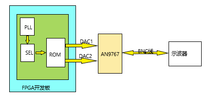

如图所示，这是此设计的大致模型图：
 1. 由PLL锁相环生成高频的时钟
 2. 由SEL数据选择器选择不同的地址位
 3. 由PLL和SEL共同作用，使ROM中的数据输出
 4. ROM的数字信号通过AN9767转换成模拟信号
 5. 通过BNC线连接示波器显示

下面分别介绍一下，各个模块的具体实现

4.3.1 预设电压值
+++++++++++++

预设电压值，需要用到工具——**波形数据生成器**

操作步骤如下：
 1. 双击exe文件打开该工具
 2. 点击 **查看 --> 全局参数**，设置为如下：
  .. image:: ./canshu.PNG
   :width: 200
 3. 设置后能立即看到网格图发生了变化
 4. 点击 **查看 --> 数据曲线**，设置后便能看到波形曲线
 5. 点击 **手绘波形 --> 线条**，此时切换到手绘模式
 6. 手动在图中绘制想要设置的波形
 7. 点击 **保存** 选择合适位置保存即可（默认保存为.mif文件）

下图是我设置的电压值的缩略图：

.. image:: ./image_v.png
 :width: 200px

由图可以看到，我手绘了4个不同高度的电压值。
通过记事本打开保存的.mif文件，可以看到图形其实是由这些十六进制数据保存在文件中的

 .. image:: ./image_v_dig.png
  :width: 200px

参考下载：
 :download:`波形生成器 <Guagle_wave.exe>`

 :download:`参考.mif文件 <four_v.mif>`

4.3.2 数据选择器
+++++++++++++++

.. image:: ./sel.jpg
选择器的原理很简单，利用A\ :sub:`1`\ A\ :sub:`0`\ 的数据选择特性选择不同的输出

=========================================== ===========
选择输入：A\ :sub:`1`\ A\ :sub:`0`\          输出 F
------------------------------------------- -----------
00                                          D\ :sub:`0`\
------------------------------------------- -----------
01                                          D\ :sub:`1`\
------------------------------------------- -----------
10                                          D\ :sub:`2`\
------------------------------------------- -----------
11                                          D\ :sub:`3`\
=========================================== ===========

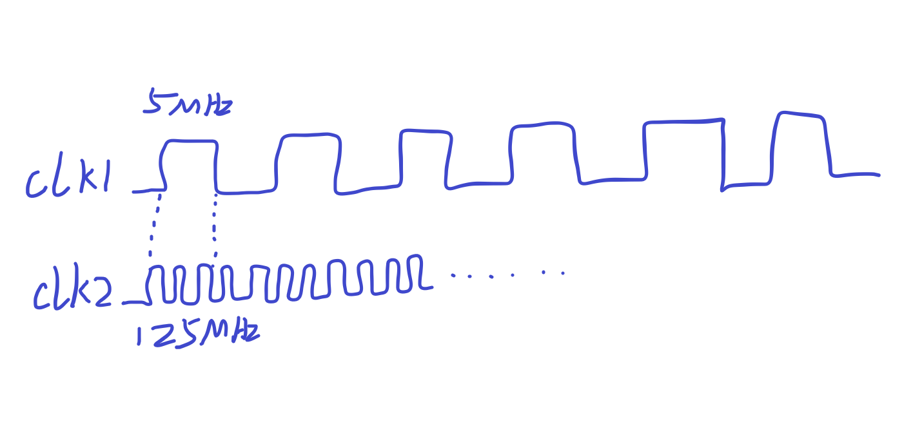

选择波形如上，利用频率差进行选择。

电压随机的原理是利用频率差，因为目前所用的AN9767的DAC板的最高采样率为125Mbps，然后再利用一个低频率为5MHz的选择波形去选择125MHz的输出波形（这时一个周期的采样点为125/5 = 25 个），
最后得到的理想输出频率应该和低频率一致为5MHz，但是由于实际环境及电路的影响，最后输出的波形频率为1.4 ~ 2MHz。这也是之前测试的结果。 这里为什么会选5MHz 和 125 MHz。
因为DAC模块的最高能够识别的频率就为125MHz，频率再高也只能识别为125MHz。低频率选择为5MHz的原因是由于采样点的问题，如果一个周期的采样点取少了（例如取5个或者10个）会导致出来的电压波形不是一个平顶，
而是一个尖峰。 通常使用的正弦波或者其他波形的采样点都是一个周期里1024个采样点。所以这里的25个已经是我测试的这么多次里面最低且满足效果的了，如果采样点再减少则波形无法满足预设要求。

具体实现的verilog代码如下 ::

    module mux( d1, d2, d3, d4, sel, dout);
        
        input d1;
        input d2;
        input d3;
        input d4;
        input [1:0] se1;
        
        output out;
        reg out;
        
        always @(d1 or d2 or d3 or d4 or sel)
        
        case({sel})
            2'b00 : out = d1;
            2'b01 : out = d2;
            2'b10 : out = d3;
            2'b11 : out = d4;
        endcase

    endmodule
 
上面就是简单的数据选择器的实现代码，在我的方法中就采用了这种思想，但不是生搬硬套得将上述的代码直接copy进去，
而仅是采用通过输入选择输出的这种思想，如果你还不是很明白，那么我在下面会详细说明。

4.3.3 ROM和PLL的IP核设置
+++++++++++++++++

ROM IP核设置如下：

 1. 在 *Quartus II* 中，点击 **Tool --> MegaWizard Plug-In Manager** 在弹出的窗口选择第一项 *Create a new custom megafunction variation*
 2. 在左侧中选择 **ROM:1-PORT**, 再在 *output file* 栏里输入IP的名称以及存放IP的目录，语法选择Verliog
 3. 设置 ROM 的数据宽度为14bits,数据的深度为1024个数据，如下图红框所示
  .. image:: ./rom1.png
   :width: 300px
 4. 中间的步骤默认点击 *next* 即可，直到到达下图页面，设置之前保存好的mif文件
   .. image:: ./rom2.PNG
    :width: 300px
 5. 继续点击 *next* 直到最后，点击 **Finish**，这样一个ROM的IP核就设置完成
 
设置完成后，能在 *Quartus II* 中查看到设置好的IP核，如果想改动参数，直接双击即可再次进入设置流程重新设置

PLL IP核设置如下：

 1. 在 *Quartus II* 中，点击 **Tool --> MegaWizard Plug-In Manager** 在弹出的窗口选择第一项 *Create a new custom megafunction variation*
 2. 在左侧窗口的I/O文件夹下选择 **ATLPLL**, 再在 *output file* 栏里输入IP的名称以及存放IP的目录，语法选择Verliog
 3. 首先设置开发板上的基础时钟以及位数，模式选择普通模式即可，如下图红框所示
  .. image:: ./pll.png
   :width: 300px
 4. 中间的步骤点击 *next* 即可，直到到达下图页面，此处点击红框，然后手动输入想要PLL输出的频率，如下图所示：
   .. image:: ./pll2.png
    :width: 300px
 5. 如果想要继续设置多个输出，则在第4步设置完成后，点击next，接着重复第4步的工作即可。本型号的FPGA板可支持4个PLL输出
 6. 如果只想设置1个或者几个输出，在设置完后直接点击Finish即可

 
.. warning::
 上述IP核的设置过程，仅针对目前的项目。如有其它需求或想深入了解还请参考 `ROM及PLL的IP核设置详解 <https://www.cnblogs.com/huangsanye/p/5257119.html>`_

4.3.4 代码的形成
++++++++++++++++++

 ————代码的实现不是一蹴而就的，而是前面步骤的积累，自然而然产生的结果

总体实现verilog代码(只展示顶层文件代码) ::

    module random_v(clk, da1_clk, da1_wrt, da1_data, da2_clk, da2_wrt, da2_data); 

        input clk, 
        output da1_clk, 
        output da1_wrt, 
        output [13:0] da1_data,
        output da2_clk, 
        output da2_wrt, 
        output [13:0] da2_data 

        reg [9:0] rom_addr; 
        wire [13:0] rom_data; 
        wire clk_50; 
        wire clk_125; 
        
        
        assign da1_clk=clk_125; 
        assign da1_wrt=clk_125;
        assign da1_data=rom_data; 
        
        assign da2_clk=clk_125; 
        assign da2_wrt=clk_125; 
        assign da2_data=rom_data; 
        
    always @(posedge clk_125) 
    begin
        if(sel[4:3] == 2'b00) 
            begin
                if(10'd0 <= rom_addr <= 10'd255) 
                begin
                rom_addr <= rom_addr + 1'b1 ; 
                end
                else begin
                rom_addr <= 10'd0;
            end 
        end
        
        else if(sel[4:3] == 2'b01) begin
        if(10'd256 <= rom_addr <= 10'd511) begin
            rom_addr <= rom_addr + 1'b1;
            else begin
            rom_addr <= 10'd256;
            end 
        end
        
        else if(sel[4:3] ==2'b01) begin
        if(10'd512 <= rom_addr <= 10'd767) begin
            rom_addr <= rom_addr + 1'b1; 
            end
            else begin
            rom_addr <= 10'd512;
            end 
        end
        
        else begin
        if(10'd768 <= rom_addr <= 10'd1023) begin
            rom_addr <= rom_addr + 1'b1;
            end
            else begin
            rom_addr <= 10'd768;
            end 
        end   
    end

    wire div_out;
    div_f	div_f_inst(
            .clk(clk),
            .div_out(div_out)
            );

    wire qq;
    wire load;
    sample sample_inst(
                .d(clk_125),
                .clk(div_out),
                .load(load),
                .qq(qq)
    );
    wire [2:0] sel;                  
    RanGen RanGen_inst(
                .clk (clk),
                .load(load),
                .seed(qq),
                .sel (sel)  
    );
    
    ROM ROM_inst (
                .clock   (clk_125),
                .address (rom_addr), 
                .q       (rom_data)
    ); 
    
    pll pll_inst( 
                .areset  (1'b0),
                .inclk0  (clk),
                .c0      (clk_50), 
                .c1      (clk_125),
                .locked  ()  
    ); 
 
 endmodule

上面的代码是针对每个模块的例化，其中包括对ROM、PLL的IP核文件的例化，对伪随机发生器、分频器的例化。\
因为上述为硬件描述性语言verilog，而本文档支持的编程语言为python，由于语法冲突故没有在上述代码添加注释。

参考下载： 

:download:`verilog完整程序 <verilog_test.rar>`

5. 关于联合测试的资料整理
==================

由于之前实现PC与FPGA的通信是借助了示例中提供的工具，虽然能够实现通信，但是那样带来的弊端是十分缺乏稳定性和保密性，故基于此缺点，我决定绕过
这个中间工具，自己独立开发一套适用于与FPGA通信的代码。

为此我决定比较不同的通信模式的优劣势以及实现上的性价比

5.1 利用UART实现通信
--------------

.. note::

    UART是一种异步收发传输器，骑其在数据发送时将并行数据转换为串行数据来传输，
    在数据接收时将接收到的串行数据转换成并行数据，可以实现全双工传输和接收。
    在FPGA开发板设计中，UART用来与PC进行通信，包括数据通信，命令和控制信息的传输。

5.1.1 UART通信过程
++++++++++++++++

  1. UART首先将接收到的并行数据转换成串行数据来传输。消息帧从一个低位起始位开始，后面是7个或8个数据位，然后是一个可用的奇偶位和一个或几个高位停止位
  #. 接收器发现开始位时它就知道数据准备发送，并尝试与发送器时钟频率同步
  #. 如果选择了奇偶校验，UART就在数据位后面加上奇偶位。奇偶位可用来帮助错误校验
  #. 在接收过程中，UART从消息帧中去掉起始位和结束位，对进来的字节进行奇偶校验，并将数据字节从串行转换成并行

传输时序图如图所示：

.. image:: ./uart.png

5.1.2 硬件介绍
++++++++++++++

AX530开发板上含有UART串口用于开发板与PC间的串口通信。串口原理图如下图所示：

.. image:: ./uart_usb.png

其中 UART_RXD为PC-->FPGA的串行数据，UART_TXD为PFGA-->PC的串行数据

.. warning::

  USB转UART需要安装相应的驱动，这些驱动程序 允许CP2102 USB-UART桥接设备在通信应用软件显示为一个COM端
  驱动是否安装成功，可以在设备管理器下查看

5.1.3 串口发送程序模块设计(由FPGA发送给PC) 
++++++++++++++++

针对本项目，并且基于示例程序，我设计了适合本项目的用于通信的UART程序模块，共分为3个部分：

    1. **时钟产生程序** ：用于产生发送数据的时钟频率，需要针对相应的波特率做修改
    2. **uart串口发送程序** ：通过串口在时钟到来时将数据发送出去
    3. **uart串口发送测试程序** ：用于测试串口发送的数据是否正确

5.1.3.1 时钟产生程序
^^^^^^^^^^^^^^

时钟产生程序verilog代码::

    `timescale 1ns / 1ps
    //////////////////////////////////////////////////////////////////////////////////
    // Module Name:    clkdiv  
    ////////////////////////////////////////////////////////////////////////////////// 
    
    module clkdiv(clk50, rst_n, clkout); 
    input clk50;              //系统时钟 50MHz
    input rst_n;              //收入复位信号 
    output clkout;            //采样时钟输出 
    reg clkout; 
    reg [15:0] cnt; 
 
    /////分频进程, 50Mhz的时钟28分频//////////
    /////50Mhz÷(16*波特率)=分频数
    /////50M÷(16*115200)=27.1267≈28
    /////波特率：每秒钟通过信道传输的码元数称为码元传输速率
    /////波特率是传输通道频宽的指标,本程序中 数据的传输频率为115200÷16 = 7200个8位数据信号/s

    always @(posedge clk50 or negedge rst_n)
        begin
        if (!rst_n) begin // 初始化+给初值
                clkout <=1'b0;
                cnt<=0;   
            end
            else if(cnt == 16'd13) begin
                clkout <= 1'b1;     
                cnt <= cnt + 16'd1;   
            end
            else if(cnt == 16'd27) begin // 因为是从0开始计数，所以此处为27
                clkout <= 1'b0;
                cnt <= 16'd0;
            end
            else begin
                cnt <= cnt + 16'd1;
            end
        end
    endmodule

对于程序中提到的波特率，可由下图确定：

.. imange:: ./bote.png

右图可看出，波特率从4800bps/s开始，之后的波特率都是4800的倍数，以此类推。

串口通讯，主从双方波特率必须一致才能有效传递数据，9600是使用最多的一个波特率，所以默认状态下一般都是设置成9600。
对于串口通讯而言，波特率越高，有效传输距离越小，而9600这个波特率，兼顾了传输速度和常用传输距离，一般为10米左右，最大不超过20米。
如果为115200，一般距离不超过5米。常用2~3米左右。
上述采用波特率为115200进行传输，在保证了传输距离的情况下尽可能增加传输速度

5.1.3.2 uart串口发送程序
^^^^^^^^^^^^^^

串口发送程序::

    `timescale 1ns / 1ps
    ////////////////////////////////////////////////////////////////////////////////// 
    // Module Name: uarttx  
    // 说明：16个clock上升沿发送一个bit(即8位二进制数据)
    //      16个clock时钟中的操作：一个起始位 + 8个数据位 + 一个奇偶校验位 + 一个停止位 + 剩余的空缺位
    ////////////////////////////////////////////////////////////////////////////////// 
    
    module uarttx(clk, rst_n, datain, wrsig, idle, tx); 
    
    input clk;                //UART时钟，由时钟产生模块给出 
    input rst_n;              //系统复位
    input [7:0] datain;       //需要发送的数据 
    input wrsig;              //发送命令，上升沿有效 
    output idle;              //线路状态指示，高为线路忙，低为线路空闲 
    output tx;                //发送数据信号 
    
    reg idle, tx; 
    reg send; 
    reg wrsigbuf, wrsigrise; 
    reg presult; 
    reg[7:0] cnt;             //计数器 
    parameter paritymode = 1'b0; 
    
    //////////////////////////////////////////////////////////////// 
    //检测发送命令wrsig的上升沿 
    //////////////////////////////////////////////////////////////// 
    
    always @(posedge clk) 
    begin
        wrsigbuf <= wrsig;
        wrsigrise <= (~wrsigbuf) & wrsig;
    end 
    
    //////////////////////////////////////////////////////////////// 
    //启动串口发送程序 
    //////////////////////////////////////////////////////////////// 
    
    always @(posedge clk) 
    begin
    if (wrsigrise && (~idle))  //当发送命令有效且线路为空闲时，启动新的数据发送进程
        begin
            send <= 1'b1;   
        end   
        else if(cnt == 8'd168)      //一帧数据发送结束，这里的168指代一帧数据走完需要经过的上升沿个数
        begin
            send <= 1'b0;
        end 
    end 
    
    //////////////////////////////////////////////////////////////// 
    //串口发送程序, 16个时钟发送一个bit 
    //////////////////////////////////////////////////////////////// 
    always @(posedge clk or negedge rst_n) 
    begin
        if (!rst_n) 
        begin
            tx <= 1'b0;          
            idle <= 1'b0;
            cnt <= 8'd0;    
            presult <= 1'b0;   
        end    
        
        else if(send == 1'b1)  
        begin
            case(cnt)                 //产生起始位
                8'd0: 
                    begin
                        tx <= 1'b0;  //给入低位触发，即将传输数据     
                        idle <= 1'b1;          
                        cnt <= cnt + 8'd1;     
                    end     
                8'd16:
                    begin          
                        tx <= datain[0];    //发送数据0位          
                        presult <= datain[0]^paritymode;          
                        idle <= 1'b1;          
                        cnt <= cnt + 8'd1;
                    end     
                8'd32:
                    begin 
                        tx <= datain[1];    //发送数据1位          
                        presult <= datain[1]^presult;          
                        idle <= 1'b1;          
                        cnt <= cnt + 8'd1;     
                    end     
                8'd48:
                    begin          
                        tx <= datain[2];    //发送数据2位          
                        presult <= datain[2]^presult;          
                        idle <= 1'b1;          
                        cnt <= cnt + 8'd1;     
                    end     
                8'd64: 
                    begin          
                        tx <= datain[3];    //发送数据3位          
                        presult <= datain[3]^presult;          
                        idle <= 1'b1;          
                        cnt <= cnt + 8'd1;     
                    end     
                8'd80: 
                    begin           
                        tx <= datain[4];    //发送数据4位          
                        presult <= datain[4]^presult;          
                        idle <= 1'b1;          
                        cnt <= cnt + 8'd1;     
                    end     
                8'd96: 
                    begin
                        tx <= datain[5];    //发送数据5位          
                        presult <= datain[5]^presult;          
                        idle <= 1'b1;          
                        cnt <= cnt + 8'd1;     
                    end     
                8'd112: 
                    begin
                        tx <= datain[6];    //发送数据6位          
                        presult <= datain[6]^presult;          
                        idle <= 1'b1;          
                        cnt <= cnt + 8'd1;     
                    end     
                8'd128: 
                    begin           
                        tx <= datain[7];    //发送数据7位          
                        presult <= datain[7]^presult;          
                        idle <= 1'b1;          
                        cnt <= cnt + 8'd1;     
                    end     
                8'd144: 
                    begin          
                        tx <= presult;      //发送奇偶校验位          
                        presult <= datain[0]^paritymode;          
                        idle <= 1'b1;
                        cnt <= cnt + 8'd1;     
                    end     
                8'd160: 
                    begin 
                        tx <= 1'b1;         //发送停止位                      
                        idle <= 1'b1;          
                        cnt <= cnt + 8'd1;     
                    end     
                8'd168: 
                    begin  
                        tx <= 1'b1;                       
                        idle <= 1'b0;       //一帧数据发送结束          
                        cnt <= cnt + 8'd1;     
                    end     
                default:
                    begin          
                        cnt <= cnt + 8'd1;  //cnt只要不等于16的倍数就自加1，即是16个时钟上升沿对应发送一位数据    
                    end    
            endcase   
        end   
        else  
        begin     
            tx <= 1'b1;  // 一帧数据传完，置高位  
            cnt <= 8'd0; // 一帧传完数据又重置cnt
            idle <= 1'b0; // 线路状态指示为低，表示线路空闲
        end 
    end 
    endmodule 

5.1.3.3 uart串口发送测试程序
^^^^^^^^^^^^^^

串口测试程序verilog代码::

    `timescale 1ns / 1ps 
    ///////////////////////////////////////////////////////
    // Module Name: testuart  
    ///////////////////////////////////////////////////////
    
    module testuart(clk, rst_n, dataout, wrsig); 
    input clk; 
    input rst_n; 
    output[7:0] dataout; 
    output wrsig; 
    reg [7:0] dataout; 
    reg wrsig;
    reg [7:0] cnt;
    always @(posedge clk or negedge rst_n) 
    begin
        if(!rst_n) 
        begin
            cnt<=8'd0;   
            wrsig<=1'b0;   
        end   
        else 
        begin      
            if(cnt == 254)              
                begin    
                    dataout <= dataout + 8'd1;  // 每次数据加“1”    
                    wrsig <= 1'b1;              // 产生发送命令    
                    cnt <= 8'd0;    
                end    
            else    
            begin    
                wrsig <= 1'b0;    
                cnt <= cnt + 8'd1;    
            end   
        end    
    end 
    endmodule

串口测试程序产生串口发送的数据(0~0xFF)和发送命令信号给串口发送模块请求发送

5.1.3.4 顶层文件实现
^^^^^^^^^^^^^^

编写好3个verilog串口发送程序模块后,新建一个名为uart_tx的工程并把这3个verilog程序添加到项目中,再依次右键点击这3个程序文件把它们转化为原理图的symbol
然后利用Quartus II的顶层文件原理图功能来实现该项目的顶层文件。

点击菜单File->New....再选择Block Diagram/Schematic File来打开一个原理图设计文件:

用导线连接各个模块如下图所示，其中testuart的dataout[7..0]和uarttx的datain[7..0]之间用Diagonal Bus Tool连接; 
其它的线用Diagonal Node Tool连接。

.. image:: ./uart_top.png

修改完后保存为uart_tx.bdf文件并设置为Top程序。再编译整个项目，编译成功后，打开Pin Planner进行FPGA的管脚和IO电压的配置。

1.3.5 串口发送数据的测试
^^^^^^^^^^^^^^

用USB线连接PC和开发板的J12，打开串口调试助手。在串口调试助手里把端口号设置为我们前面在设备管理器中看到的端口号(即COM号)，设置波特率为115200, 校验位不需要设置，停止位为1。
下载项目的 uart_tx.sof 文件到开发板，我们可以在串口工具的窗口上看到从FPGA开发板不断发给PC的从0到FF的16进制的测试数据。
如下图所示：

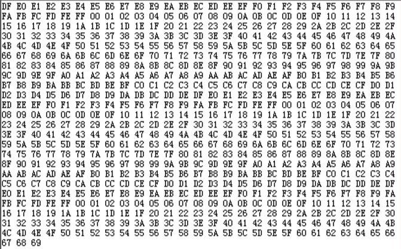

5.1.4 串口接收程序模块设计(由FPGA接收PC的数据)
----------
   -----实现并验证了串口发送程序后，可以编写串口的接收程序

UART接收模块的Verilog HDL 语言代码如下::
 
    ////////////////////////////////////////////////////////////////////////////////// 
    // Module name    uartrx.v 
    // 说明：16个clock接收一个bit，16个时钟采样，取中间的采样值 
    ////////////////////////////////////////////////////////////////////////////////// 
    
    module uartrx(clk, rst_n, rx, dataout, rdsig, dataerror, frameerror); 
    input clk;             //采样时钟 
    input rst_n;           //复位信号 
    input rx;              //UART数据输入 
    output dataout;        //接收数据输出 
    output rdsig; 
    output dataerror;      //数据出错指示 
    output frameerror;     //帧出错指示 
    
    reg[7:0] dataout; 
    reg rdsig, dataerror; 
    reg frameerror; 
    reg [7:0] cnt; 
    reg rxbuf, rxfall, receive; 
    parameter paritymode = 1'b0; 
    reg presult, idle; 
    
    always @(posedge clk)   //检测线路的下降沿 
    begin   
        rxbuf <= rx;   
        rxfall <= rxbuf & (~rx); 
    end 
    
    ////////////////////////////////////////////////////////////////
    //启动串口接收程序 
    //////////////////////////////////////////////////////////////// 
    
    always @(posedge clk) 
    begin
        if (rxfall && (~idle)) 
        begin//检测到线路的下降沿并且原先线路为空闲，启动接收数据进程
            receive <= 1'b1;   
        end   
        else if(cnt == 8'd168) 
        begin //接收数据完成     
            receive <= 1'b0;   
        end 
    end 
    
    //////////////////////////////////////////////////////////////// 
    //串口接收程序, 16个时钟接收一个bit 
    //////////////////////////////////////////////////////////////// 
    always @(posedge clk or negedge rst_n) 
    begin
    if (!rst_n) 
        begin 
            idle<=1'b0;    
            cnt<=8'd0;      
            rdsig <= 1'b0;      
            frameerror <= 1'b0;     
            dataerror <= 1'b0;       
            presult<=1'b0;   
        end      
    else if(receive == 1'b1) 
        begin   
            case (cnt)   
                8'd0:
                    begin    
                        idle <= 1'b1;    
                        cnt <= cnt + 8'd1;    
                        rdsig <= 1'b0;   
                    end   
                8'd24:
                    begin                 //接收第0位数据    
                        idle <= 1'b1;    
                        dataout[0] <= rx;    
                        presult <= paritymode^rx;    
                        cnt <= cnt + 8'd1;    
                        rdsig <= 1'b0;   
                    end   
                8'd40:
                    begin                 //接收第1位数据      
                        idle <= 1'b1;    
                        dataout[1] <= rx;    
                        presult <= presult^rx;   
                        cnt <= cnt + 8'd1;    
                        rdsig <= 1'b0;   
                    end   
                8'd56:
                    begin                 //接收第2位数据       
                        idle <= 1'b1;    
                        dataout[2] <= rx;    
                        presult <= presult^rx;    
                        cnt <= cnt + 8'd1;    
                        rdsig <= 1'b0;   
                    end   
                8'd72:
                    begin               //接收第3位数据       
                        idle <= 1'b1;    
                        dataout[3] <= rx;    
                        presult <= presult^rx;    
                        cnt <= cnt + 8'd1;    
                        rdsig <= 1'b0;   
                    end   
                8'd88:
                    begin               //接收第4位数据        
                        idle <= 1'b1;    
                        dataout[4] <= rx; 
                        presult <= presult^rx;    
                        cnt <= cnt + 8'd1;    
                        rdsig <= 1'b0;   
                    end   
                8'd104:
                    begin            //接收第5位数据        
                        idle <= 1'b1;    
                        dataout[5] <= rx;    
                        presult <= presult^rx;    
                        cnt <= cnt + 8'd1;    
                        rdsig <= 1'b0;   
                    end   
                8'd120:
                    begin            //接收第6位数据        
                        idle <= 1'b1;    
                        dataout[6] <= rx;    
                        presult <= presult^rx;    
                        cnt <= cnt + 8'd1;    
                        rdsig <= 1'b0;   
                    end   
                8'd136:
                    begin            //接收第7位数据       
                        idle <= 1'b1;    
                        dataout[7] <= rx;    
                        presult <= presult^rx;    
                        cnt <= cnt + 8'd1;    
                        rdsig <= 1'b1;   
                    end   
                8'd152:
                    begin            //接收奇偶校验位        
                        idle <= 1'b1;    
                        if(presult == rx)      
                            dataerror <= 1'b0;    
                        else     
                            dataerror <= 1'b1;       //如果奇偶校验位不对，表示数据出错    
                        cnt <= cnt + 8'd1;    
                        rdsig <= 1'b1;   
                    end   
                8'd168:
                    begin     
                        idle <= 1'b1;     
                        if(1'b1 == rx)     
                            frameerror <= 1'b0;     
                        else     
                            frameerror <= 1'b1;      //如果没有接收到停止位，表示帧出错     
                        cnt <= cnt + 8'd1;     
                        rdsig <= 1'b1;   
                    end   
                default: 
                    begin    
                        cnt <= cnt + 8'd1; 
                    end   
            endcase    
        end     
    else 
    begin    
        cnt <= 8'd0;    
        idle <= 1'b0;    
        rdsig <= 1'b0;    
    end 
end 
endmodule 

.. note:: 

    接收数据过程：空闲状态，线路处于高电位；当检测到线路的下降沿（线路电位由高电位变为低电位）时说明线路有数据传输，
    按照约定的波特率从低位到高位接收数据，数据接收完毕后，接着接收并比较奇偶校验位是否正确，如果正确则通知后续设备准备接收数据或存入缓存。
    由于UART是异步传输，没有传输同步时钟。为了能保证数据传输的正确性，UART采用16倍数据波特率的时钟进行采样。每个数据有16个时钟采样，取中间的采样值，以保证采样不会滑码或误码。
    一般UART一帧的数据位数为8，这样即使每个数据有一个时钟的误差，接收端也能正确地采样到数据。

5.1.4.1 顶层原理图设计
^^^^^^^^^^^^

这里我们重新新建一个工程为 uart_test, 再把 clkdiv.v, uarttx.v 和 uartrx.v 这３个文件添加到工程并转化成symbol文件。
再利用和上面同样的操作，利用Quartus II 的原理图功能实现一个原理图文件并命名为uart_test.bdf文件作为项目的顶层文件，设计好的原理图如下图所示

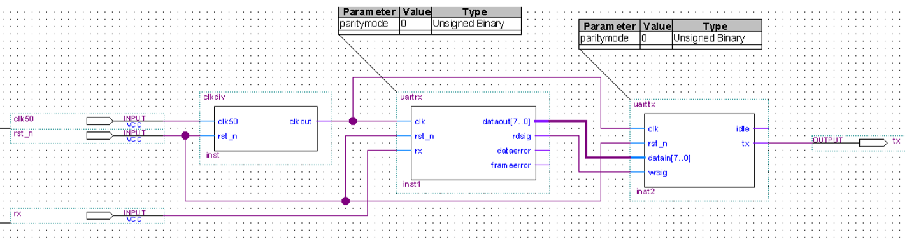

5.1.4.2 串口接收实验验证
^^^^^^^^^^^^

重新编译成功后，打开Pin Planner约束管脚以及电平，然后再次编译，通过后下载 uart_test.sof 文件到开发板。
打开串口调试助手，进行验证，在串口工具里发送一个字符串给FPGA开发板，我们这里发送“AX530 FPGA Board”，
在串口工具的接收窗口会马上显示“AX530 FPGA Board”，说明FPGA接收到PC串口发送的数据并马上发回给PC，FPGA的接收和发送模块与PC的串口通信正确。 

5.1.5 利用python实现串口调试助手
----------

上面的过程最后的验证操作都是利用了串口调试助手，如何绕过该助手将数据下发给FPGA，这个问题之前我思考了很久，发现自己走进了一个死胡同。
今天终于豁然开朗，调式助手工具是利用程序代码编写的，用python肯定也能够实现相应的功能，只要知道需要的操作，利用python的特性能够很快实现。

由于本项目原有代码是利用python2.X书写的，所以为了统一，此处也利用python2.X来实现

利用python实现串口调试助手的代码::
    
    # -*- coding: utf-8 -*-
    import serial

    #打开串口
    serialPort="COM3"   # 指定串口
    baudRate=9600       # 设置波特率
    
    ser=serial.Serial(serialPort,baudRate,timeout=0.5)  
    print "参数设置：串口=%s ，波特率=%d" %(serialPort,baudRate)

    #收发数据
    while 1: # 一直监听串口

        str = input("请输入要发送的数据: ")
        ser.write((str+'\n').encode())
        print(ser.readline()) # 接收数据 
        
    ser.close() # 关闭串口

上面是利用python实现串口通信的最简单的写法，还可以继续完善，比如校验位，停止位都可以进行设置。

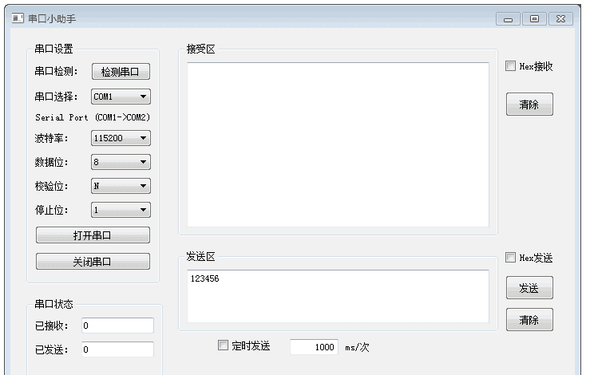

上图是利用pyqt+python实现的一个串口调试助手界面，以后可以将此界面中的发送区隐藏使用自身产生的随机数，
然后将其也加入之前的软件界面中，这样就实现了一体化的自动化控制。

这是利用串口实现通信，利用网络调试助手同理也可以这样实现。

6. 随机电压系统带载性能测试
============

6.1 实验名称
-----------
实验名称： 利用FPGA输出随机电压的负载带载能力验证实验

FPGA输出随机电压，将随机电压输入给PM的SMA接口并在示波器上观察通过光电转换后的电信号是否符合预期

6.2 实验目的
-------------
实验目的： 验证带载能力（是否能够带载IM以及PM）

验证此目的是为以后做关于调制解调等方面工作打下基础（可基于需要在现有工作上做修改即可）。

6.3 实验步骤
------------

6.3.1 绘制原理框图
+++++++++++++++++

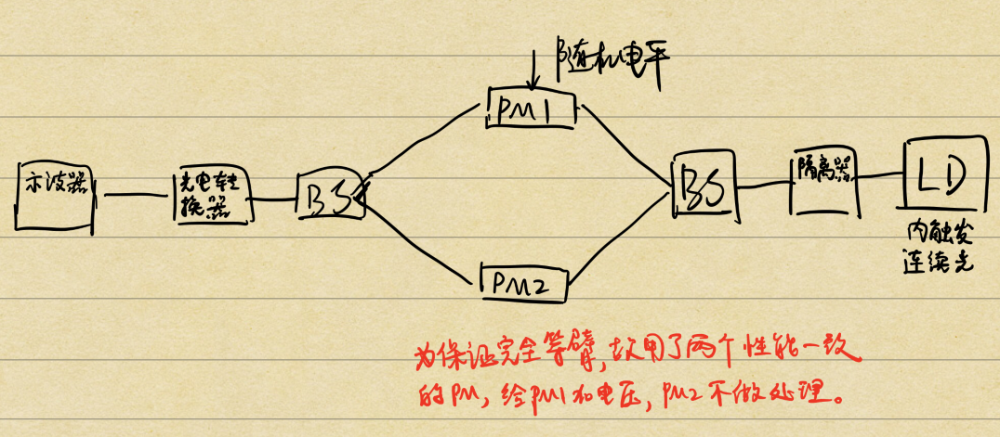

6.3.2 实验仪器设备选用
+++++++++++++++++

    1. 激光器： 选用问天的激光器（内调制，1mW，连续光输出）
    2. 隔离器
    3. PM： 选用网站上的PM-10、PM-12两个参数相近的PM（为保证严格等臂，使用两个但只对其一输入随机电平）
    4. BS： 选用编号为 BS-3、BS-4
    5. 光电转换器

6.3.3 实验平台搭建
++++++++++++++++

.. image:: ./15476477161.png

搭建过程中，利用手持光功率计查看功率是否符合预期值。

6.3.4 实验现象
+++++++++++++++

图1. 未接负载时，随机电平的示波器波形

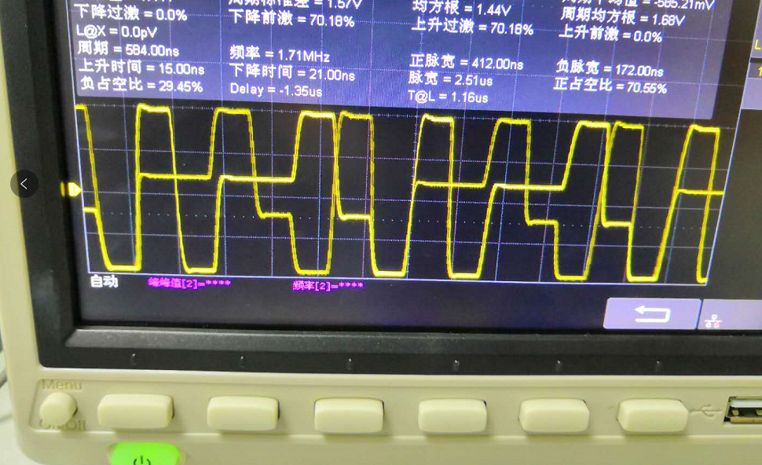

图2. 接上PM负载后，随机电平的示波器波形

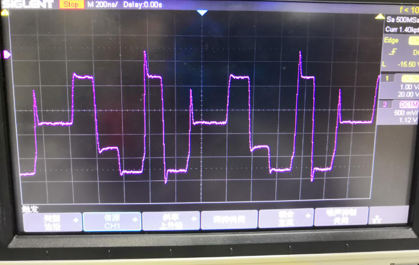

图3. 调节DA板上的滑动变阻器旋钮，消去吉布斯效应后，随机电平的示波器波形

.. image:: ./tu3.png

------------

图4. 随机电平调制后的光信号（已经过光电转换）

.. image:: ./tu4.png

紫色的波形是随机电平的波形，黄色的波形是光信号经过等臂PM后经光电转换出来的波形。
虽然黄色的波形不是平顶的（一方面可能受随机电平的影响，也由于本验证实验没有加PC，所以出来的黄色波形不是特别好），但是它的变化趋势是和随机电平的变化趋势是一样的

6.3.5 实验结论
++++++++++++++

以上实验可以看出本项目的FPGA输出的随机电平信号是具有带载PM的能力的

但是还需要改进的点有：
 
 1. 提高随机电平的随机性
 2. 提高随机电平的输出频率
 3. 提高随机电平的输出电压

