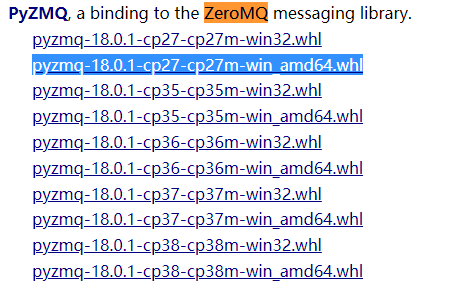

==========
01_快速开始
==========

能够快速搭建并使用诱骗态量子光源设备的软件和硬件环境

0. 直接使用
==========

由于已经提前将程序文件打包成exe可执行文件，所以只要具备以下的环境条件便可以直接使用诱骗态量子光源的控制软件:

.. note::
    1. Window7及以上64位操作系统 ( Window7以下系统为未测试 ) 
    #. 电脑有以太网口

若你的设备已具备以上条件，那么可以直接打开文件中的.exe可执行文件。

1. 环境搭建
===========

如果你想对程序做一些修改，或许你可以直接运行程序。运行程序需要具备的一些环境条件如下:

1.1 安装Python2.7.x
--------------------

Python2.7.x中的x表示可以是2.7系列的任意子版本。如Python2.7.15、Python2.7.3等

Python下载官方地址:
`Python.org <https://www.python.org/>`_

或者直接在浏览器中输入Python进行搜索打开

1.2 Python2.7.x第三方库安装
---------------------

由于使用了一些第三方库进行编写程序，所以需要在安装完成Python之后将需要的第三方库也安装完成。

.. note::
    一般的安装方法是如下图所示打开至Python所在目录下的此处( 这里以python3.6为例，python2亦是如此 ):

    .. image:: ./lujin.png

    然后在此文件夹下打开命令行窗口并在窗口中输入: ``pip install xxxxx`` (其中的xxxxx则为你需要安装的第三方库)

不过可能会由于一些其他的原因（如某一些第三方库服务器在国外，使用上述的这种方法安装会超时）导致通过这种方式并不能成功安装。本程序中所需要的第三方库Zeromq就是如此。

1.2.1 zmq库的安装
^^^^^^^^^^^^^^^^

1. 首先打开网址:`https://www.lfd.uci.edu/~gohlke/pythonlibs/#babel <https://www.lfd.uci.edu/~gohlke/pythonlibs/#babel>`_
这个网址中记录了python需要的所有版本的第三方库的下载地址

2. 利用ctrl + F在该页面检索zmq，如下图所示：

.. note::
    1. 图中蓝色部分即是我们需要下载的第三方库文件，这里的cp27表示是python2.7版本，win_amd64即表示为window下的64位系统
    2. 点击下载后我们会得到一个后缀为whl的文件，将其保存到1.2节中所介绍的python的第三方库目录的文件夹下
    3. 在此处打开命令行窗口并输入: ``pip install pyzmq‑18.0.1‑cp27‑cp27m‑win_amd64.whl``

这样就能够成功安装zmq第三方库。

2. 运行.py文件
===========

如果你已经安装上面的操作完成了Python2.7的环境搭建和三方库的安装，
那么你便可以使用python的IDE工具或者自带的IDLE打开文件夹中的.py文件。

同时你还能够根据需要修改程序内部的功能或者新增功能，程序的注释已在内部给出。

