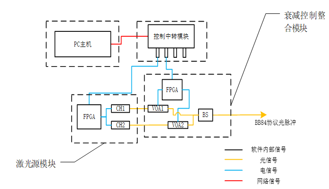
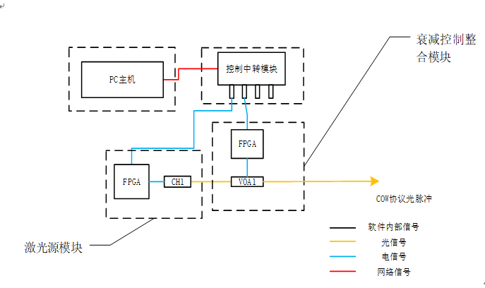

=============
02_文档具体内容
=============

1. 预期目标
==============

本文档的预期目标是能够实现一套适用于双协议的诱骗态量子光源设备。主要的预期指标如下:

.. note::
    1. 实现 **双协议** 兼容并能够快速切换
    2. 实现软件部分对硬件部分的控制
    3. 设备在随机数下发过程中能够长时间稳定性( **8小时以上** )
    4. 实现的双协议为 **BB84协议** 和 **COW协议** ，并且BB84协议传输频率为10Mhz，COW协议的传输频率为40Mhz

2. 可行性分析
==============

本文档所要实现的适用于双协议的诱骗态量子光源设备使用软件和硬件配合的方式。其中，软件部分使用Python进行编写，在软件部分，其可行性分析如下:

.. note::
    1. python的易于学习和快速开发的特性能够使我们快速的实现一套既定目标的软件系统
    2. 由于实现的协议为BB84协议和COW协议，利用代码语言实现它们的传输过程较易实现
    3. python具有众多的第三方库，能够使它和其他软件语言甚至硬件语言达到较好的融合度
    4. 由于软件的灵活，可以实现较多的用于诱骗态量子光源的功能

适用于双协议的诱骗态量子光源设备的硬件部分主要采用的仪器是FPGA开发板、中转控制模块、电控可调衰减器等，其可行性分析如下:

.. note::
    1. FPGA开发板可以使用verlig语言进行编写，verlig是较易入门的硬件描述语言
    2. 本系统中交给硬件执行的部分只是对于指令的执行和反馈，其他部分都是交由软件来执行，所以在硬件语言的编写上具有技术实现的可行性
    3. 硬件部分中除了中转控制软件之外的其他仪器和设备本实验室都具有，所以在成本上具有可行性
    4. 硬件处理的难点是对于软件命令的接收，这一步要用到FPGA开发板中的以太网口来接收，这一部分具有难度，不过也是可行的

3. 需求分析
==============

3.1 软件需求分析
--------------

在本节中会对于设备实现的软件部分进行需求分析，并根据具体的需求来对于软件部分进行实现。
软件的需求分析将按照下述两个部分进行展开:

1. 功能需求分析:对于用户想要实现的一些功能通过软件来实现
2. 性能需求分析:性能需求主要是对于设备工作时的稳定度，准确度或者安全性进行分析

下面将对于这两个部分进行说明。

3.1.1 软件功能需求分析
++++++++++++++++++++

经过调研和考虑，在本系统中所需要的主要功能需求共有以下几种：

.. note::
    1.	**一键点击** 即可以发送随机的密钥信息；
    2.	能够实时地获取各种参数的值，具体包括：**激光管温度**、**模块内FPGA板的温度**、**激光模块各通道频率**、**激光模块各通道光强** 等；
    3.	能够实时地设置各个硬件设备的参数值，具体包括：**激光模块各通道的偏置电压**、**衰减模块的衰减值**等；
    4.	在BB84协议中，可以 **任意调节** 诱骗态的占比范围（0~100%之间），满足实验平台的各种可能性；
    5.	能够在发送过程中 **暂停** 和 **继续** 密钥信息的发送；
    6.	可以把系统发送的所有密钥信息 **存储** 在本地文档中，同时能够由使用者选择是否将密钥信息实时显示在界面中；
    7.	使用友好的UI界面实现以上所有功能；
    8.	将软件应用打包成exe可执行文件格式，保护源代码和密钥安全。

以上是软件部分的功能需求的具体内容，下面变会根据这里的需求进行分析和实现

3.1.2 软件性能需求分析
++++++++++++++++++++

软件系统的优差最终的落脚点还是性能好坏来决定的。所以对于性能上的需求是本软件设计部分的核心，同时也是能够反映软件系统安全的。
下面给出本文档的性能需求：

.. note::
    1.	软件发送的信息能够正确打包并下发至硬件设备，**保证不丢包**，**不重发**。能够高效准确的发出指定的密钥信息；
    2.	软件在 **遇到错误** 输入时不发生错误并 **给出提示**，增强了自身健壮性；
    3.	密钥信息处理的 **实时性** 和 **准确性**，由于发送密钥信息的本质是由软件内的随机数决定的，所以为了保证系统发送密钥信息的准确性，系统在内部需要对随机数进行部分分割；
    4.	为了增加本软件的 **可识别性** 和 **可扩展性**，尽量减少软件中模块与模块间的耦合性，增加或者减少软件功能都变得十分方便。

3.2 硬件需求分析
--------------

本系统中使用的硬件模块如下：

.. note::

    1.	中转控制设备：与PC主机直接联系，接收与回传信息；
    #.	双通道激光源：波长为1550nm，支持外触发的稳定激光源设备；
    #.	Alter Cyclone-IV系列 FPGA开发板：接收信息并执行操作；
    #.	电控可调衰减器：实现对于光脉冲强度的电控可调；
    #.	BS光纤分束耦合器：用于BB84协议中多路光脉冲的合束。

------------------

1. 中转控制设备

因为在本系统中是利用以太网实现软件和硬件设备的信息传递，在系统运行时，ARM中转控制设备只要接收到来自软件的信息，就会根据信息中的选择信号，选择将该部分信息发送给激光源模块中的FPGA开发板还是发送给衰减控制整合模块中的FPGA开发板。所以其在整体系统中的作用就是中转信息的功能。

2．双通道激光源

激光源设备在整个系统中的作用是脉冲的产生和输出。它具有多个脉冲输出通道且波长为1550nm，能够通过外部的电信号触发。

3. FPGA开发板

本系统选取的开发板为Alter Cyclone-IV系列的FPGA开发板，板上的硬件资源完全满足文中所述的功能和性能需求。同时使用Verilog语言进行硬件编程，能快速地实现硬件部分的代码需求。

4. 电控可调衰减器

电控可调衰减器能够通过输入电压的变化实现不同的衰减值，由于激光源输出的光脉冲强度并不是准单光子量级，在量子密钥分发中需要将初始光脉冲衰减至准单光子量级，所以在激光源模块之后还需要使用衰减控制整合模块来对光脉冲进行后续的处理。

5. 光纤分束耦合器

本系统采用的是ORTE Photonics公司50:50的2*2光纤分束耦合器，它的作用是在本系统实现的BB84协议中将时分复用的两路光脉冲耦合为一路。 

通过对上述的硬件设备及器件的需求介绍，能够更加明确本系统的设计思想，同时阐述了各个硬件设备的参数和功能，对于硬件实现方面给出了准确可靠的实现方案和实现步骤。

4. 方案设计
============

4.1 强度控制类协议方案(BB84协议)方案设计
------------------------

诱骗态BB84协议方案的实现步骤如下：

    1.	PC主机中运行的上位机软件向控制中转模块发送包含诱骗态位置信息的二级制随机码信息；
    2.	ARM[21]控制中转模块接收到上位机的随机码信息后，将信息分发给激光源模块和衰减控制整合模块中的FPGA板；
    3.	激光源模块中的FPGA开发板对二进制随机码信息进行解析计算，0表示输出控制激光源的CH1通道触发的电脉冲，1表示输出控制激光源的CH2通道触发的电脉冲，它们两路电脉冲是时分的；
    4.	衰减控制整合模块中的FPGA开发板通过分析软件传来的衰减值信息（衰减值信息为十进制的0~30之间的数），将接收到的十进制数据转换为对应的电平信号，输入给电控可调衰减器（VOA1和VOA2）；
    5.	步骤3中的两路光脉冲通过衰减控制整合模块中的电控可调衰减器，将其强度衰减软件设置的衰减值，得到的衰减后的脉冲通过衰减控制整合模块中的BS分束耦合器耦合为一路光脉冲，即为含诱骗态的满足BB84协议的光脉冲。

4.2 时间控制类协议方案(COW协议)方案设计
------------------------

COW协议方案的实现步骤如下：

    1.	PC主机中运行的上位机软件向控制中转模块发送包含诱骗态位置信息的二级制随机码信息；
    2.	ARM控制中转模块接收到上位机的随机码信息后，将信息分发给激光源模块和衰减控制整合模块中的FPGA板；
    3.	激光源模块中的FPGA开发板通过分析二进制随机码信息，0表示不产生控制激光源的CH1通道触发的电脉冲，1表示产生控制激光源的CH1通道触发的电脉冲； 
    4.	衰减控制整合模块中的FPGA开发板对软件传来的衰减值信息进行分析（衰减值信息为十进制的0~30之间的数），将接收到的十进制数据转换为对应的电平信号，输入给电控可调衰减器（VOA1）；
    5.	步骤3中的光脉冲通过衰减控制整合模块中的电控可调衰减器，将其强度衰减软件设置的衰减值，得到的衰减后的脉冲即为满足COW协议的光脉冲。

5. 系统实现
==============

5.1 软件实现
--------------

根据上述提出的软件需求分析和BB84协议以及COW协议的方案设计，对软件的功能进行规划分析，最后形成软件的实现。
其中，实现了诱骗态随机划分的算法以及其他的各项功能(实现的主要功能参见) `03_软件功能详解 <https://project-summary.readthedocs.io/zh_CN/latest/%E8%BD%AF%E4%BB%B6%E5%AE%9E%E7%8E%B0%E5%8A%9F%E8%83%BD%E5%92%8C%E5%85%B7%E4%BD%93%E4%BB%A3%E7%A0%81.html>`_ 其他的内容参见论文3.2.2节——软件实现。

5.2 硬件方案
--------------

设备的接口是设备间通信的关键桥梁，在本系统中也是软件和硬件联系的纽带。如下：

.. note::

    1.	 以太网口（软件与硬件间的联系）：以太网口是PC和硬件通信的桥梁，它是一种使用同轴电缆作为网络媒体，采用载波多路访问和冲突检测机制的通信方式，数据传输速率达到1Gbit/s；
    2.	 USB串口（硬件之间的联系）：硬件内部中的各个模块是利用串口进行通信的，串口通信具有简单方便，故障率低，抗干扰能力强等优点。

其他的硬件介绍请参见论文3.2.2——硬件方案

6. 参考文档
==============
